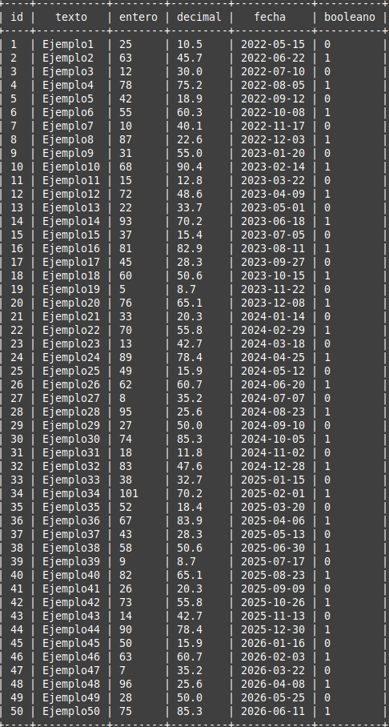
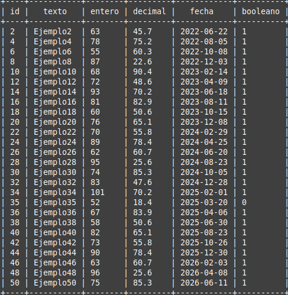
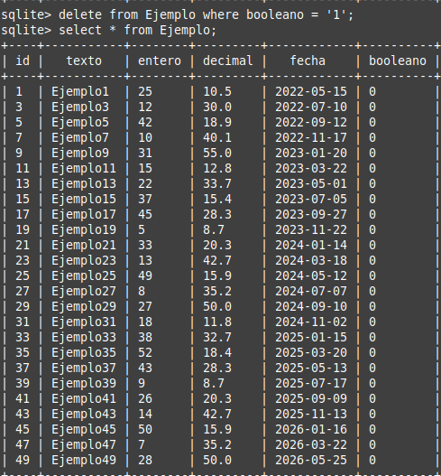
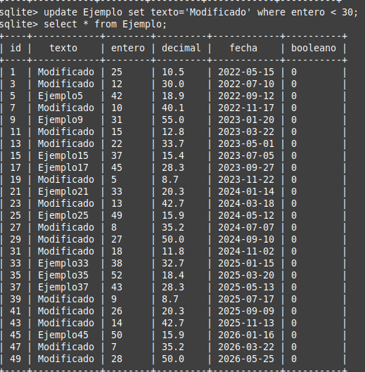
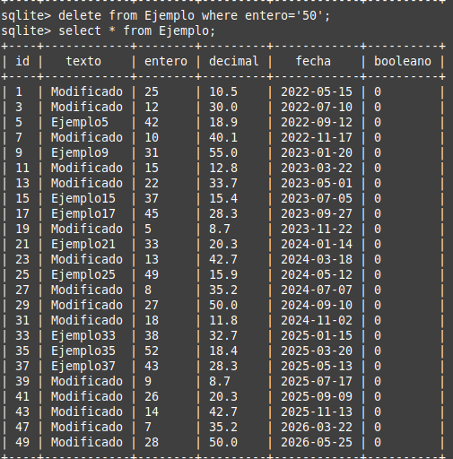
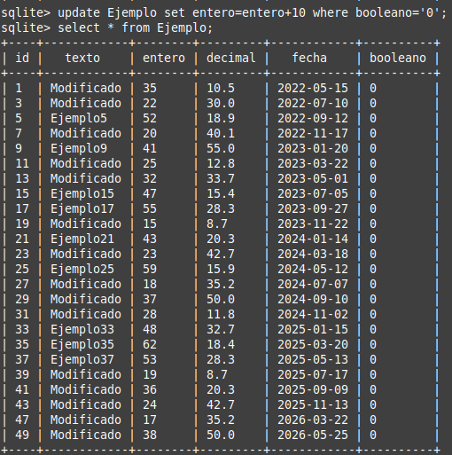
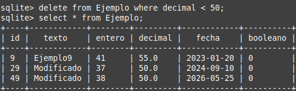
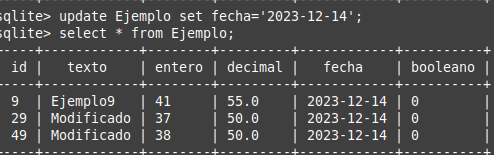

# Tarea-práctica de bases de datos

<div align=center>
    


*Pez de la buena suerte.*

</div>

<div align=justify>

## Paso 1.1 - Crear la base de datos
La base de datos llamada **tarea1** se crea con:
```bash
sqlite3 tarea1.db
``` 

## Paso 1.2 - Crear la tabla 'Ejemplo'

Ahora creamos la primera tabla llamada **Ejemplo** con:
```sql
create table Ejemplo (
    id integer not null primary key autoincrement,
    texto text,
    entero integer,
    decimal real,
    fecha date,
    booleano boolean
);
```
## Paso 2 - Inserción de los 50 registros en la tabla

Dado que el proceso es largo, se resumirá lo realizado mostrando únicamente los primeros y últimos dos registros:

```sql
insert into Ejemplo (texto, entero, decimal, fecha, booleano) values ('Ejemplo1', '25', '10.5', '2022-05-15', '0');
insert into Ejemplo (texto, entero, decimal, fecha, booleano) values ('Ejemplo2', '63', '45.7', '2022-06-22', '1');

...

insert into Ejemplo (texto, entero, decimal, fecha, booleano) values ('Ejemplo49', '28', '50.0', '2026-05-25', '0');
insert into Ejemplo (texto, entero, decimal, fecha, booleano) values ('Ejemplo50', '75', '85.3', '2026-06-11', '1');
```

</div>

## Paso 3 - Consulta de datos

Ya que fueron agregados los datos a la tabla, vamos a comprobar todos con el siguiente comando, pero primero, facilitemos su visualización cambiando el modo en el que se muestra la información con:

```sql
.mode table
```

Ahora, para consultar **todos** los datos de la tabla *Ejemplo*, se escribe:

```sql
select * from Ejemplo;
```

Como resultado da la siguiente tabla:

<div align=center>



</div>

Ahora, para seleccionar todos los registros **cuyos valores enteros sean mayores a 50**, se debería escribir:

```sql
select * from Ejemplo where entero > 50;
```

Dando como resultado:

<div align=center>



</div>

## Paso 4 - Eliminaciones y actualizaciones

Para este último paso, se deben realizar la siguiente serie de modificaciones en la tabla Ejemplo:

1. **Eliminar las entradas donde su valor booleano sea True:**

```sql
delete from Ejemplo where booleano = '1';
```
<div align=center>

### Resultado


</div>

2. **Modifica el campo texto de las entradas donde el campo entero es menor a 30 y establece el texto como "Modificado":**

```sql
update Ejemplo set texto='Modificado' where entero < 30;
```
<div align=center>

### Resultado


</div>

3. **Elimina las entradas donde el campo entero es igual a 50:**

```sql
delete from Ejemplo where entero='50';
```
<div align=center>

### Resultado (Solo borra la entrada 45)


</div>

4. **Incrementa en 10 el valor del campo entero para las entradas donde el campo booleano es igual a False:**

```sql
update Ejemplo set entero=entero+10 where booleano='0';
```

<div align=center>

### Resultado 


</div>

5. **Elimina las entradas donde el campo decimal es menor a 50:**

```sql
delete from Ejemplo where decimal < 50;
```

<div align=center>

### Resultado 


</div>

6. **Actualiza el campo fecha de todas las entradas a la fecha actual:**

```sql
update Ejemplo set fecha='2023-12-14';
```

<div align=center>

### Resultado 


</div>
