# Tarea-creación de bases de datos

<div align=justify>

<div align=center>
    


*Pez de la buena suerte.*

</div>

## Paso 1 - Creación de la base de datos y sus tablas

1. Creamos la base de datos con el siguiente comando:
```sh
sqlite3 tarea2.db
```

2. Estando dentro del fichero .db, creamos las tablas **Propietarios** y **Vehiculos** con lo siguiente:
```sql
-- Tabla "Propietarios"
CREATE TABLE Propietarios (
id integer primary key autoincrement,
nombre text not null,
apellido text not null,
dni text unique);

-- Tabla "Vehiculos"
CREATE TABLE Vehiculos (
id integer primary key autoincrement,
marca text not null,
modelo text not null,
anio integer not null,
id_propietario integer references Propietarios(id));
```

## Paso 2 - Inserción de datos

Tras haber creado las tablas, seguiremos con la inserción de información en las mismas; a continuación unos ejemplos resumidos de las inserciones de ambas tablas:

### Tabla "Propietarios"

Cabe aclarar que en los parámetros de *Values* no se escribe la id, pues este registro se crea automáticamente por el atributo de *autoincrement* que le fue asignado previamente en la creación de la tabla:

```sql
INSERT INTO Propietarios(nombre, apellido, dni) VALUES('Juan','Perez','12345678A');         -- # 1
INSERT INTO Propietarios(nombre, apellido, dni) VALUES('Maria','Lopez','87654321B');        -- # 2
INSERT INTO Propietarios(nombre, apellido, dni) VALUES('Carlos','Ruiz','11111111C');        -- # 3
-- ...
INSERT INTO Propietarios(nombre, apellido, dni) VALUES('Clara','Soto','16161616R');         -- # 18
INSERT INTO Propietarios(nombre, apellido, dni) VALUES('Sergio','Mendoza','17171717S');     -- # 19
INSERT INTO Propietarios(nombre, apellido, dni) VALUES('Patricia','Navarro','18181818T');   -- # 20
```

### Tabla "Vehiculos"

Al igual que con la tabla **Propietarios**, no se asigna el valor *id* en el *Insert*, pues es autoincremental; en cambio, se debe asignar la *foreign key* de *id_propietario* para que haya una referencia con la tabla que corresponde:

```sql
INSERT INTO Vehiculos(marca, modelo, anio, id_propietario) VALUES('Ford','Fiesta',2019,1);
INSERT INTO Vehiculos(marca, modelo, anio, id_propietario) VALUES('Toyota','Corolla',2018,2);
INSERT INTO Vehiculos(marca, modelo, anio, id_propietario) VALUES('Nissan','Sentra',2020,3);
-- ...
INSERT INTO Vehiculos(marca, modelo, anio, id_propietario) VALUES('Toyota','Highlander',2020,18);
INSERT INTO Vehiculos(marca, modelo, anio, id_propietario) VALUES('Honda','Odyssey',2016,19);
INSERT INTO Vehiculos(marca, modelo, anio, id_propietario) VALUES('Nissan','Murano',2019,20);
```

## Paso 3 - Consultas de datos

Antes de continuar con las consultas solicitadas de la actividad, se configura el *.mode* y *.headers* en el sqlite3 (en mi caso, elegí el *mode box* porque se me hace más atractivo visualmente):

```sql
.mode box
.headers on
```

1. Seleccionar todos los propietarios:
```sql
select * from Propietarios;
```

<div align="center">

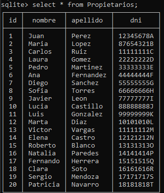

</div>

2. Listar todos los vehículos: 
```sql
select * from Vehiculos;
```
<div align="center">

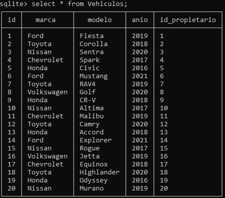

</div>

3. Seleccionar solo los nombres y apellidos de los propietarios:
```sql
select nombre, apellido from Propietarios;
```

<div align="center">

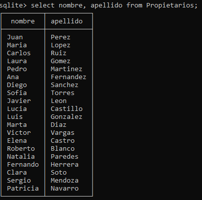

</div>

4. Listar todas las marcas y modelos de los vehículos: 
```sql
select marca, modelo from Vehiculos;
```

<div align="center">

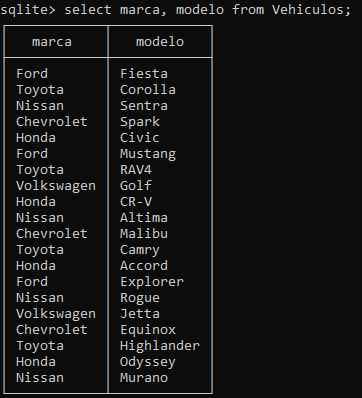

</div>

5. Seleccionar solo los propietarios con apellido "Perez":
```sql
select * from Propietarios where apellido='Perez';
```

<div align="center">

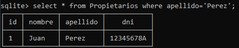

</div>

6. Listar todos los vehículos con año 2019: 
```sql
select * from Vehiculos where anio=2019;
```

<div align="center">

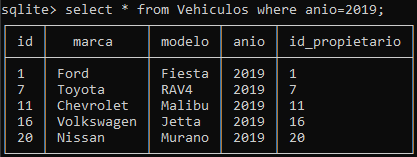

</div>

7. Seleccionar propietarios que tienen vehículos de la marca "Toyota":
```sql
select * from Propietarios as prop, Vehiculos as veh where veh.id_propietario = prop.id and veh.marca='Toyota';
```

<div align="center">

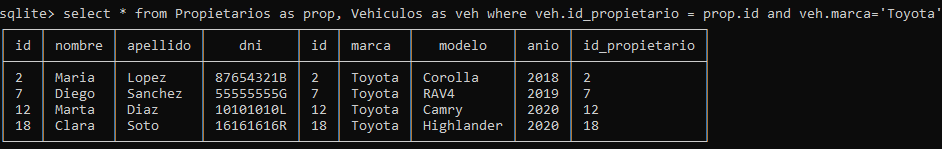

</div>

8. Listar vehículos con marca "Ford" y modelo "Fiesta": 
```sql
select * from Vehiculos where marca='Ford' and modelo='Fiesta';
```

<div align="center">

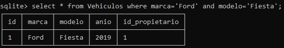

</div>

9. Seleccionar propietarios con DNI "12345678A":
```sql
select * from Propietarios where dni='12345678A';
```

<div align="center">

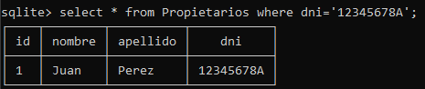

</div>

10. Listar vehículos que pertenecen al propietario con ID 5:
```sql
select * from Vehiculos where id_propietario=5;
```

<div align="center">

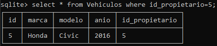

</div>

## Paso 4 - Modificaciones en las tablas

1. Actualizar el nombre de un propietario con DNI "12345678A":
```sql
update Propietarios set nombre='Juanito' where dni='12345678A';
```

<div align="center">

**Antes del Update**

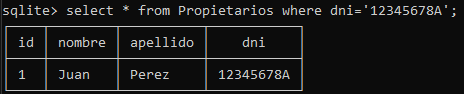

**Después del Update**

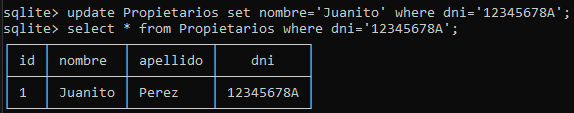

</div>

2. Modificar el año de un vehículo con ID 3 a 2022:
```sql
update Vehiculos set anio=2022 where id=3;
```

<div align="center">

**Antes del Update**

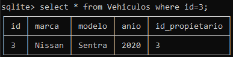

**Después del Update**

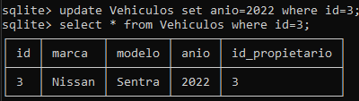

</div>

3. Cambiar el modelo de todos los vehículos Nissan a "Micra":
```sql
update Vehiculos set modelo='Micra' where marca='Nissan';
```

<div align="center">

**Antes del Update**

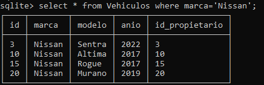

**Después del Update**

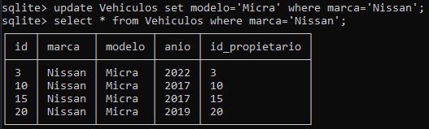

</div>

4. Actualizar el apellido de un propietario con ID 7 a "Gomez":
```sql
update Propietarios set apellido='Gomez' where id=7;
```

<div align="center">

**Antes del Update**

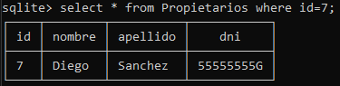

**Después del Update**

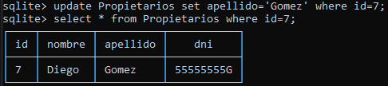

</div>

5. Modificar la marca de un vehículo con modelo "Fiesta" a "Renault":
```sql
update Vehiculos set marca='Renault' where modelo='Fiesta';
``` 

<div align="center">

**Antes del Update**

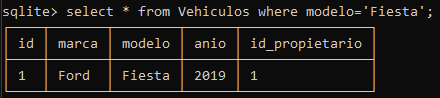

**Después del Update**

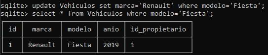

</div>

</div>