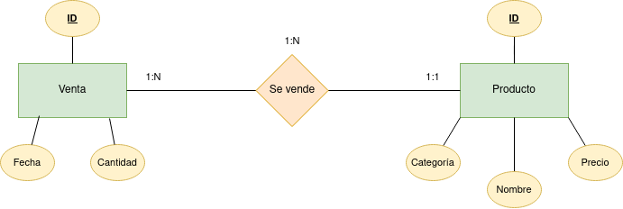
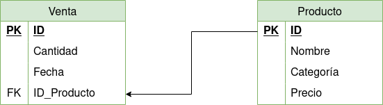

# Tarea4 - Trabajo con funciones

<div align=center>
    


*Patricio, el pez de la buena suerte.*

</div>

<div align=justify>

## Índice

- [Paso 1. Creación de la base de datos](#paso-1---creación-de-la-bases-de-datos)
    - [Tabla *Producto*](#tabla-productos)
    - [Tabla *Ventas*](#tabla-ventas)
- [Paso 2. Diagramas](#paso-2---diagramas)
    - [Diagrama entidad-relación](#diagrama-er)
    - [Diagrama modelo-relacional](#diagrama-mr)
- [Paso 3. Ejercicios de consultas](#paso-3---consultas)

## Paso 1 - Creación de la bases de datos

Para esta actividad, ya se nos dispone el siguiente fichero `supermercado-dump.sql` como base para crear la base de datos:

```sql
CREATE TABLE productos (
    id INTEGER PRIMARY KEY,
    nombre TEXT,
    categoria TEXT,
    precio REAL
);

CREATE TABLE ventas (
    id INTEGER PRIMARY KEY,
    id_producto INTEGER,
    cantidad INTEGER,
    fecha DATE,
    FOREIGN KEY (id_producto) REFERENCES productos(id)
);

INSERT INTO productos (id, nombre, categoria, precio) VALUES 
    (1, 'Arroz', 'Alimentos', 2.5),
    (2, 'Leche', 'Lácteos', 1.8),
    (3, 'Pan', 'Panadería', 1.2),
    (4, 'Manzanas', 'Frutas', 3.0),
    (5, 'Pollo', 'Carnes', 5.5),
    (6, 'Huevos', 'Lácteos', 1.0),
    (7, 'Yogurt', 'Lácteos', 2.0),
    (8, 'Tomates', 'Verduras', 2.2),
    (9, 'Queso', 'Lácteos', 4.0),
    (10, 'Cereal', 'Desayuno', 3.5),
    (11, 'Papel Higiénico', 'Hogar', 1.5),
    (12, 'Cepillo de Dientes', 'Higiene', 2.0),
    (13, 'Detergente', 'Limpieza', 2.8),
    (14, 'Galletas', 'Snacks', 1.7),
    (15, 'Aceite de Oliva', 'Cocina', 4.5),
    (16, 'Café', 'Bebidas', 5.0),
    (17, 'Sopa enlatada', 'Conservas', 2.3),
    (18, 'Jabón de Baño', 'Higiene', 1.2),
    (19, 'Botellas de Agua', 'Bebidas', 1.0),
    (20, 'Cerveza', 'Bebidas', 3.8);

INSERT INTO ventas (id_producto, cantidad, fecha) VALUES 
    (1, 5, '2024-01-17'),
    (2, 3, '2024-01-17'),
    (4, 2, '2024-01-17'),
    (5, 1, '2024-01-17'),
    (6, 10, '2024-01-18'),
    (8, 4, '2024-01-18'),
    (10, 2, '2024-01-18'),
    (14, 7, '2024-01-19'),
    (16, 3, '2024-01-19'),
    (18, 6, '2024-01-20');
```

En esta actividad, lo hice importando el fichero .sql al crear el fichero .db de la siguiente forma:

```sh
sqlite3 tarea4.db < supermercado-dump.sql
```
Como ya se sabe, otra de las formas para importar la información es usar el comando `.read supermercado-dump.sql` dentro del fichero .db.
Como resultado, tras ejecutar un `.tables`, nos damos cuenta que existen dos tablas:


### **Tabla 'Productos'**

| id |       nombre       | categoria | precio |
|----|--------------------|-----------|--------|
| 1  | Arroz              | Alimentos | 2.5    |
| 2  | Leche              | Lácteos   | 1.8    |
| 3  | Pan                | Panadería | 1.2    |
| 4  | Manzanas           | Frutas    | 3.0    |
| 5  | Pollo              | Carnes    | 5.5    |
| 6  | Huevos             | Lácteos   | 1.0    |
| 7  | Yogurt             | Lácteos   | 2.0    |
| 8  | Tomates            | Verduras  | 2.2    |
| 9  | Queso              | Lácteos   | 4.0    |
| 10 | Cereal             | Desayuno  | 3.5    |
| 11 | Papel Higiénico    | Hogar     | 1.5    |
| 12 | Cepillo de Dientes | Higiene   | 2.0    |
| 13 | Detergente         | Limpieza  | 2.8    |
| 14 | Galletas           | Snacks    | 1.7    |
| 15 | Aceite de Oliva    | Cocina    | 4.5    |
| 16 | Café               | Bebidas   | 5.0    |
| 17 | Sopa enlatada      | Conservas | 2.3    |
| 18 | Jabón de Baño      | Higiene   | 1.2    |
| 19 | Botellas de Agua   | Bebidas   | 1.0    |
| 20 | Cerveza            | Bebidas   | 3.8    |

### **Tabla 'Ventas'**

| id | id_producto | cantidad |   fecha    |
|----|-------------|----------|------------|
| 1  | 1           | 5        | 2024-01-17 |
| 2  | 2           | 3        | 2024-01-17 |
| 3  | 4           | 2        | 2024-01-17 |
| 4  | 5           | 1        | 2024-01-17 |
| 5  | 6           | 10       | 2024-01-18 |
| 6  | 8           | 4        | 2024-01-18 |
| 7  | 10          | 2        | 2024-01-18 |
| 8  | 14          | 7        | 2024-01-19 |
| 9  | 16          | 3        | 2024-01-19 |
| 10 | 18          | 6        | 2024-01-20 |

## Paso 2 - Diagramas

<div align=center> 

### Diagrama ER



### Diagrama MR



</div>

### ¿La BBDD está normalizada hasta la 3era forma normal?
Sí, pues además de cumplir la primera y la segunda forma normal (los atributos son elementos atómicos y hay dependencia funcional), cumple la tercera forma normal, pues no existen en las tablas alguna dependencia transitiva.

## Paso 3 - Consultas 

Se deben realizar las siguientes consultas y mostrar el resultado de las mismas:

- Mostrar todos los productos de la categoría "Bebidas".

```sql
select * from productos where categoria like "Bebidas";
```

| id |      nombre      | categoria | precio |
|----|------------------|-----------|--------|
| 16 | Café             | Bebidas   | 5.0    |
| 19 | Botellas de Agua | Bebidas   | 1.0    |
| 20 | Cerveza          | Bebidas   | 3.8    |

- Listar los productos ordenados por precio de forma descendente.

```sql
select * from productos order by precio desc;
```

| id |       nombre       | categoria | precio |
|----|--------------------|-----------|--------|
| 5  | Pollo              | Carnes    | 5.5    |
| 16 | Café               | Bebidas   | 5.0    |
| 15 | Aceite de Oliva    | Cocina    | 4.5    |
| 9  | Queso              | Lácteos   | 4.0    |
| 20 | Cerveza            | Bebidas   | 3.8    |
| 10 | Cereal             | Desayuno  | 3.5    |
| 4  | Manzanas           | Frutas    | 3.0    |
| 13 | Detergente         | Limpieza  | 2.8    |
| 1  | Arroz              | Alimentos | 2.5    |
| 17 | Sopa enlatada      | Conservas | 2.3    |
| 8  | Tomates            | Verduras  | 2.2    |
| 7  | Yogurt             | Lácteos   | 2.0    |
| 12 | Cepillo de Dientes | Higiene   | 2.0    |
| 2  | Leche              | Lácteos   | 1.8    |
| 14 | Galletas           | Snacks    | 1.7    |
| 11 | Papel Higiénico    | Hogar     | 1.5    |
| 3  | Pan                | Panadería | 1.2    |
| 18 | Jabón de Baño      | Higiene   | 1.2    |
| 6  | Huevos             | Lácteos   | 1.0    |
| 19 | Botellas de Agua   | Bebidas   | 1.0    |

- Calcular el precio total de todos los productos en la tabla "productos".

```sql
select sum(precio) as precio_total from productos;
```
| precio_total |
|--------------|
| 52.5         |

- Encontrar los productos con un nombre que contenga la letra 'a'.

```sql
select * from productos where nombre like "%a%";
```

| id |      nombre      | categoria | precio |
|----|------------------|-----------|--------|
| 1  | Arroz            | Alimentos | 2.5    |
| 3  | Pan              | Panadería | 1.2    |
| 4  | Manzanas         | Frutas    | 3.0    |
| 8  | Tomates          | Verduras  | 2.2    |
| 10 | Cereal           | Desayuno  | 3.5    |
| 11 | Papel Higiénico  | Hogar     | 1.5    |
| 14 | Galletas         | Snacks    | 1.7    |
| 15 | Aceite de Oliva  | Cocina    | 4.5    |
| 16 | Café             | Bebidas   | 5.0    |
| 17 | Sopa enlatada    | Conservas | 2.3    |
| 18 | Jabón de Baño    | Higiene   | 1.2    |
| 19 | Botellas de Agua | Bebidas   | 1.0    |
| 20 | Cerveza          | Bebidas   | 3.8    |

- Obtener la cantidad total de productos vendidos en todas las fechas.

```sql
select sum(cantidad) as total_vendidos from ventas;
```

| total_vendidos |
|----------------|
| 43             |

- Encontrar el producto más caro en cada categoría.

```sql
select id, nombre, max(precio) as max_precio, categoria from productos group by categoria;
```

| id |       nombre       | max_precio | categoria |
|----|--------------------|------------|-----------|
| 1  | Arroz              | 2.5        | Alimentos |
| 16 | Café               | 5.0        | Bebidas   |
| 5  | Pollo              | 5.5        | Carnes    |
| 15 | Aceite de Oliva    | 4.5        | Cocina    |
| 17 | Sopa enlatada      | 2.3        | Conservas |
| 10 | Cereal             | 3.5        | Desayuno  |
| 4  | Manzanas           | 3.0        | Frutas    |
| 12 | Cepillo de Dientes | 2.0        | Higiene   |
| 11 | Papel Higiénico    | 1.5        | Hogar     |
| 13 | Detergente         | 2.8        | Limpieza  |
| 9  | Queso              | 4.0        | Lácteos   |
| 3  | Pan                | 1.2        | Panadería |
| 14 | Galletas           | 1.7        | Snacks    |
| 8  | Tomates            | 2.2        | Verduras  |

- Listar los productos que no han sido vendidos.

```sql
select * from productos where id not in(select p.id from productos as p, ventas as v where p.id = v.id_producto);
```

| id |       nombre       | categoria | precio |
|----|--------------------|-----------|--------|
| 3  | Pan                | Panadería | 1.2    |
| 7  | Yogurt             | Lácteos   | 2.0    |
| 9  | Queso              | Lácteos   | 4.0    |
| 11 | Papel Higiénico    | Hogar     | 1.5    |
| 12 | Cepillo de Dientes | Higiene   | 2.0    |
| 13 | Detergente         | Limpieza  | 2.8    |
| 15 | Aceite de Oliva    | Cocina    | 4.5    |
| 17 | Sopa enlatada      | Conservas | 2.3    |
| 19 | Botellas de Agua   | Bebidas   | 1.0    |
| 20 | Cerveza            | Bebidas   | 3.8    |

- Calcular el precio promedio de los productos en la categoría "Snacks".

```sql
select avg(precio) as precio_promedio, categoria from productos where categoria like "Snacks"; 
```

| precio_promedio | categoria |
|-----------------|-----------|
| 1.7             | Snacks    |

- Encontrar los productos que han sido vendidos más de 5 veces.

```sql
select * from productos as p, ventas as v where p.id = v.id_producto and cantidad > 5;
```

| id |    nombre     | categoria | precio | id | id_producto | cantidad |   fecha    |
|----|---------------|-----------|--------|----|-------------|----------|------------|
| 6  | Huevos        | Lácteos   | 1.0    | 5  | 6           | 10       | 2024-01-18 |
| 14 | Galletas      | Snacks    | 1.7    | 8  | 14          | 7        | 2024-01-19 |
| 18 | Jabón de Baño | Higiene   | 1.2    | 10 | 18          | 6        | 2024-01-20 |

- Mostrar la fecha y la cantidad de ventas para cada producto.

```sql
select p.id, p.nombre, v.cantidad, v.fecha from productos as p, ventas as v where p.id = v.id_producto;
```

| id |    nombre     | cantidad |   fecha    |
|----|---------------|----------|------------|
| 1  | Arroz         | 5        | 2024-01-17 |
| 2  | Leche         | 3        | 2024-01-17 |
| 4  | Manzanas      | 2        | 2024-01-17 |
| 5  | Pollo         | 1        | 2024-01-17 |
| 6  | Huevos        | 10       | 2024-01-18 |
| 8  | Tomates       | 4        | 2024-01-18 |
| 10 | Cereal        | 2        | 2024-01-18 |
| 14 | Galletas      | 7        | 2024-01-19 |
| 16 | Café          | 3        | 2024-01-19 |
| 18 | Jabón de Baño | 6        | 2024-01-20 |

- Encontrar los productos que tienen un precio menor o igual a 2.

```sql
select * from productos where precio <= 2;
```

| id |       nombre       | categoria | precio |
|----|--------------------|-----------|--------|
| 2  | Leche              | Lácteos   | 1.8    |
| 3  | Pan                | Panadería | 1.2    |
| 6  | Huevos             | Lácteos   | 1.0    |
| 7  | Yogurt             | Lácteos   | 2.0    |
| 11 | Papel Higiénico    | Hogar     | 1.5    |
| 12 | Cepillo de Dientes | Higiene   | 2.0    |
| 14 | Galletas           | Snacks    | 1.7    |
| 18 | Jabón de Baño      | Higiene   | 1.2    |
| 19 | Botellas de Agua   | Bebidas   | 1.0    |

- Calcular la cantidad total de ventas para cada fecha.

```sql
select sum(cantidad) as total_ventas, fecha from ventas group by fecha; 
```
| total_ventas  |   fecha    |
|---------------|------------|
| 11            | 2024-01-17 |
| 16            | 2024-01-18 |
| 10            | 2024-01-19 |
| 6             | 2024-01-20 |

- Listar los productos cuyo nombre comienza con la letra 'P'.

```sql
select * from productos where nombre like "P%";
```

| id |     nombre      | categoria | precio |
|----|-----------------|-----------|--------|
| 3  | Pan             | Panadería | 1.2    |
| 5  | Pollo           | Carnes    | 5.5    |
| 11 | Papel Higiénico | Hogar     | 1.5    |

- Obtener el producto más vendido en términos de cantidad.

```sql
select p.id, p.nombre, max(v.cantidad) as max_cantidad from productos as p, ventas as v where p.id = v.id_producto;
```

| id | nombre | max_cantidad |
|----|--------|--------------|
| 6  | Huevos | 10           |

- Mostrar los productos que fueron vendidos en la fecha '__2024-01-18__'.

```sql
select p.id, p.nombre, v.fecha from productos as p, ventas as v where fecha like "2024-01-18";
```

| id | nombre  |   fecha    |
|----|---------|------------|
| 6  | Huevos  | 2024-01-18 |
| 8  | Tomates | 2024-01-18 |
| 10 | Cereal  | 2024-01-18 |

- Calcular el total de ventas para cada producto.

```sql
select p.id, p.nombre, v.cantidad as ventas from productos as p, ventas as v where p.id = v.id_producto;
```

| id |    nombre     | ventas |
|----|---------------|--------|
| 1  | Arroz         | 5      |
| 2  | Leche         | 3      |
| 4  | Manzanas      | 2      |
| 5  | Pollo         | 1      |
| 6  | Huevos        | 10     |
| 8  | Tomates       | 4      |
| 10 | Cereal        | 2      |
| 14 | Galletas      | 7      |
| 16 | Café          | 3      |
| 18 | Jabón de Baño | 6      |

- Encontrar los productos con un precio entre 3 y 4.

```sql
select * from productos where precio between 3 and 4;
```
| id |  nombre  | categoria | precio |
|----|----------|-----------|--------|
| 4  | Manzanas | Frutas    | 3.0    |
| 9  | Queso    | Lácteos   | 4.0    |
| 10 | Cereal   | Desayuno  | 3.5    |
| 20 | Cerveza  | Bebidas   | 3.8    |

- Listar los productos y sus categorías ordenados alfabéticamente por categoría.

```sql
select * from productos order by categoria;
```

| id |       nombre       | categoria | precio |
|----|--------------------|-----------|--------|
| 1  | Arroz              | Alimentos | 2.5    |
| 16 | Café               | Bebidas   | 5.0    |
| 19 | Botellas de Agua   | Bebidas   | 1.0    |
| 20 | Cerveza            | Bebidas   | 3.8    |
| 5  | Pollo              | Carnes    | 5.5    |
| 15 | Aceite de Oliva    | Cocina    | 4.5    |
| 17 | Sopa enlatada      | Conservas | 2.3    |
| 10 | Cereal             | Desayuno  | 3.5    |
| 4  | Manzanas           | Frutas    | 3.0    |
| 12 | Cepillo de Dientes | Higiene   | 2.0    |
| 18 | Jabón de Baño      | Higiene   | 1.2    |
| 11 | Papel Higiénico    | Hogar     | 1.5    |
| 13 | Detergente         | Limpieza  | 2.8    |
| 2  | Leche              | Lácteos   | 1.8    |
| 6  | Huevos             | Lácteos   | 1.0    |
| 7  | Yogurt             | Lácteos   | 2.0    |
| 9  | Queso              | Lácteos   | 4.0    |
| 3  | Pan                | Panadería | 1.2    |
| 14 | Galletas           | Snacks    | 1.7    |
| 8  | Tomates            | Verduras  | 2.2   

- Calcular el precio total de los productos vendidos en la fecha '2024-01-19'.

```sql
select p.id, p.nombre, p.precio*v.cantidad as precio_total, v.fecha from productos as p, ventas as v where p.id = v.id_producto and v.fecha like "2024-01-19";
```

| id |  nombre  | precio_total |   fecha    |
|----|----------|--------------|------------|
| 14 | Galletas | 11.9         | 2024-01-19 |
| 16 | Café     | 15.0         | 2024-01-19 |

- Mostrar los productos que no pertenecen a la categoría "__Higiene__".

```sql
select * from productos where categoria not like "Higiene";
```

| id |      nombre      | categoria | precio |
|----|------------------|-----------|--------|
| 1  | Arroz            | Alimentos | 2.5    |
| 2  | Leche            | Lácteos   | 1.8    |
| 3  | Pan              | Panadería | 1.2    |
| 4  | Manzanas         | Frutas    | 3.0    |
| 5  | Pollo            | Carnes    | 5.5    |
| 6  | Huevos           | Lácteos   | 1.0    |
| 7  | Yogurt           | Lácteos   | 2.0    |
| 8  | Tomates          | Verduras  | 2.2    |
| 9  | Queso            | Lácteos   | 4.0    |
| 10 | Cereal           | Desayuno  | 3.5    |
| 11 | Papel Higiénico  | Hogar     | 1.5    |
| 13 | Detergente       | Limpieza  | 2.8    |
| 14 | Galletas         | Snacks    | 1.7    |
| 15 | Aceite de Oliva  | Cocina    | 4.5    |
| 16 | Café             | Bebidas   | 5.0    |
| 17 | Sopa enlatada    | Conservas | 2.3    |
| 19 | Botellas de Agua | Bebidas   | 1.0    |
| 20 | Cerveza          | Bebidas   | 3.8    |


- Encontrar la cantidad total de productos en cada categoría.

```sql
select categoria, count(categoria) as cantidad_productos from productos group by categoria;
```
| categoria | cantidad_productos |
|-----------|--------------------|
| Alimentos | 1                  |
| Bebidas   | 3                  |
| Carnes    | 1                  |
| Cocina    | 1                  |
| Conservas | 1                  |
| Desayuno  | 1                  |
| Frutas    | 1                  |
| Higiene   | 2                  |
| Hogar     | 1                  |
| Limpieza  | 1                  |
| Lácteos   | 4                  |
| Panadería | 1                  |
| Snacks    | 1                  |
| Verduras  | 1                  |

- Listar los productos que tienen un precio igual a la media de precios.

```sql
select * from productos where precio = (select avg(precio) from productos);
```
> **No se imprime ninguna tabla pues no se encuentran productos con un precio igual a la media de precios.**

- Calcular el precio total de los productos vendidos en cada fecha.

```sql
select sum(p.precio*v.cantidad) as precio_total, v.fecha from productos as p, ventas as v where p.id = v.id_producto group by v.fecha;
```
| precio_total |   fecha    |
|--------------|------------|
| 29.4         | 2024-01-17 |
| 25.8         | 2024-01-18 |
| 26.9         | 2024-01-19 |
| 7.2          | 2024-01-20 |

- Mostrar los productos con un nombre que termina con la letra 'o'.

```sql
select * from productos where nombre like "%o";
```
| id |     nombre      | categoria | precio |
|----|-----------------|-----------|--------|
| 5  | Pollo           | Carnes    | 5.5    |
| 9  | Queso           | Lácteos   | 4.0    |
| 11 | Papel Higiénico | Hogar     | 1.5    |
| 18 | Jabón de Baño   | Higiene   | 1.2    |

- Encontrar los productos que han sido vendidos en más de una fecha.

```sql
select p.id, p.nombre, v.fecha from productos as p, ventas as v where p.id = v.id_producto group by p.id having count(distinct fecha) > 1;
```
> **No se imprime tabla porque no hay producto que haya sido vendido en más de una fecha.**

- Listar los productos cuya categoría comienza con la letra 'L'.

```sql
select * from productos where categoria like "L%";
```
| id |   nombre   | categoria | precio |
|----|------------|-----------|--------|
| 2  | Leche      | Lácteos   | 1.8    |
| 6  | Huevos     | Lácteos   | 1.0    |
| 7  | Yogurt     | Lácteos   | 2.0    |
| 9  | Queso      | Lácteos   | 4.0    |
| 13 | Detergente | Limpieza  | 2.8    |

- Calcular el total de ventas para cada producto en la fecha '2024-01-17'.

```sql
select p.id, p.nombre, p.precio*v.cantidad as total_ventas, v.fecha from productos as p, ventas as v where p.id = v.id_producto and fecha like "2024-01-17";
```
| id |  nombre  | total_ventas |   fecha    |
|----|----------|--------------|------------|
| 1  | Arroz    | 12.5         | 2024-01-17 |
| 2  | Leche    | 5.4          | 2024-01-17 |
| 4  | Manzanas | 6.0          | 2024-01-17 |
| 5  | Pollo    | 5.5          | 2024-01-17 |

- Mostrar los productos cuyo nombre tiene al menos 5 caracteres.

```sql
select * from productos where length(nombre) >= 5;
```
| id |       nombre       | categoria | precio |
|----|--------------------|-----------|--------|
| 1  | Arroz              | Alimentos | 2.5    |
| 2  | Leche              | Lácteos   | 1.8    |
| 4  | Manzanas           | Frutas    | 3.0    |
| 5  | Pollo              | Carnes    | 5.5    |
| 6  | Huevos             | Lácteos   | 1.0    |
| 7  | Yogurt             | Lácteos   | 2.0    |
| 8  | Tomates            | Verduras  | 2.2    |
| 9  | Queso              | Lácteos   | 4.0    |
| 10 | Cereal             | Desayuno  | 3.5    |
| 11 | Papel Higiénico    | Hogar     | 1.5    |
| 12 | Cepillo de Dientes | Higiene   | 2.0    |
| 13 | Detergente         | Limpieza  | 2.8    |
| 14 | Galletas           | Snacks    | 1.7    |
| 15 | Aceite de Oliva    | Cocina    | 4.5    |
| 17 | Sopa enlatada      | Conservas | 2.3    |
| 18 | Jabón de Baño      | Higiene   | 1.2    |
| 19 | Botellas de Agua   | Bebidas   | 1.0    |
| 20 | Cerveza            | Bebidas   | 3.8    |

- Encontrar los productos que tienen un precio superior al precio máximo en la tabla "__productos__".

```sql
select * from productos where precio > (select max(precio) from productos);
```
> **No se imprime tabla pues no se encuentra un producto con un precio mayor al precio máximo.**

</div>
