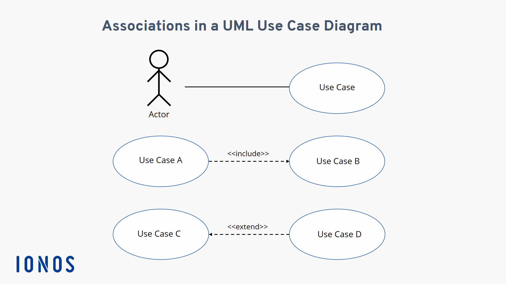
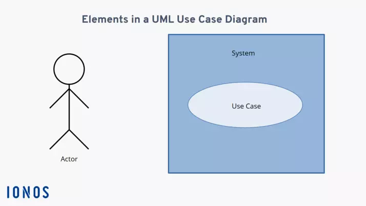
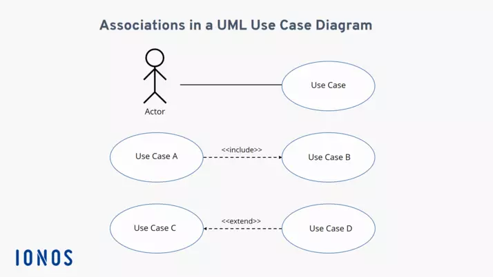

# Unidad 04 - Elaboración de diagramas de comportamiento

    

A pesar de que David le haya puesto como nombre de unidad "diagramas de _comportamiento_", los realmente vistos no pertenecen a esta categoría (bueno, solo uno).

Estos son:

## Diagramas de casos de uso

Este es un __diagrama estructural__ y suele ser uno de los primeros diagramas a realizar cuando se planea crear un software. Esto porque plantea las funciones más importantes de un sistema.

En estos diagramas, las funciones de sistemas se suelen representar desde el punto de vista de un usuario, que se le llama __actor__. Dicho actor puede no ser necesariamente un ser humano; también lo puede ser un sistema externo. De este modo, este tipo de diagramas muestra __la relación entre un actor y sus requisitos o expectativas del sistema__, sin representar las acciones que tienen lugar o ponerlas en un orden lógico.

### Elementos

Hay tres elementos principales:
- __Actor:__ se representa con el dibujo de una figura humana.
- __Sistema:__ se representa con un rectángulo.
- __Caso de uso:__ se muestra como un elipse que suele incluir un texto descriptivo del proceso.

    

Entre los actores y los casos de usos existen __relaciones__ (representadas con flechas) que pueden ser de distintos tipos:

- __Flecha continua:__ actor y caso de uso.
- __Flecha discontinua:__ relación entre casos de usos que puede ser...
        - __<<include>>__: ambos casos de uso se deben realizar.
        - __<<exclude>>__: la realización de un caso de uso PUEDE incluir otro si se cumple cierta condición.

    

## Diagramas de secuencia

### Elementos

## Diagramas de actividades

### Elementos

