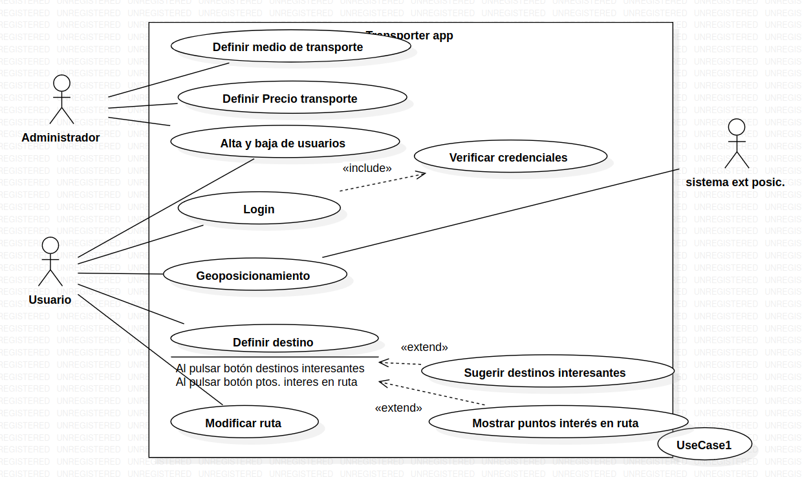

# Ejercicio de tablas sobre un diagrama de casos de uso

Tomando en cuenta el diagrama visto en la clase, las tablas que definen los actores y los casos de usos son:

## Actor

|  Actor | Administrador |
|---|---|
| Descripción  | Persona cuyos privilegios son utilizados para administrar la aplicación del diagrama de casos de uso. |
| Características  | Capacidad para definir y manejar la información contenida en la aplicación |
| Relaciones | Se relaciona con el **usuario** cuando realiza la *alta y baja de usuarios*.  |
| Referencias | *Definir medio de transporte*, *Definir precio de transporte*, *Alta y baja de usuarios*. |   
|  Notas | *N/A* |
| Autor  | Jesús Daniel Lugo López |
|Fecha | 9 de Enero, 2024 |

## Caso de uso

|  Caso de Uso	CU | Definir medio de transporte  |
  |---|---|
  | Fuentes  | *App Transport* |
  | Actor  |  Administrador |
  | Descripción | Definición del medio de transporte |
  | Flujo básico |  <table><tr><th>Paso</th><th>Acción</th></tr><tr><td>1</td><td>Toma de entrada la elección del administrador.</td></tr><tr><td>2</td><td>Define el medio de transporte según la entrada.</td></tr></table> |
  | Flujo alternativo | <table><tr><th>Paso</th><th>Acción</th></tr><tr><td>1</td><td>Si el usuario no elige ninguna opción...</td></tr><tr><td></td><td>1. Se finaliza el proceso de la aplicación.</td></tr></table>
  | Pre-condiciones | *N/A* |  
  | Post-condiciones  | El medio de transporte estará definido en el sistema.  |  
  |  Requerimientos | *N/A* |
  |  Notas |  *N/A* |
  | Autor  | Jesús Daniel Lugo López |
  |Fecha | 9 de Enero, 2024 |

