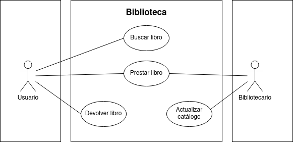

# Diagrama de casos de uso - Biblioteca

## Especificación de los actores

|  Actor | Usuario |
|---|---|
| Descripción  | Persona quien irá a la biblioteca a buscar libros o devolverlos. |
| Relaciones | Con el **bibliotecario**, cada vez que presta un libro, este se lo otorga. |
| Referencias | **Buscar libro**, **Prestar libro** y **Devolver libro** |   
| Autor  | Jesús Daniel Lugo López |
|Fecha | 16 de Enero, 2024 |

|  Actor | Bibliotecario |
|---|---|
| Descripción  | Quien administra el catálogo de libros disponibles y presta los libros a los usuarios. |
| Relaciones | Con el **usuario**, al prestar un libro.  |
| Referencias | **Prestar libro** y **Actualizar catálogo** |   
| Autor  | Jesús Daniel Lugo López |
|Fecha | 16 de Enero, 2024 |

## Especificación de los casos de uso

  |  Caso de Uso	CU | Buscar libro  |
  |---|---|
  | Actor  |  Usuario |
  | Descripción | El usuario podrá buscar un libro deseado en el catálogo de la biblioteca |
  | Flujo básico | <table><tr><th>Paso</th><th>Acción</th></tr><tr><td>1</td><td>Usuario introduce nombre y/o autor del libro.</td></tr><tr><td>2</td><td>El sistema devolverá si este está disponible.</td></tr><tr><td>3</td><td>Presentará la opción de solicitarlo.</td></tr><tr><td>4</td><td>Al pedirlo, se le enviará la solicitud al bibliotecario.</td></tr></table> |
  | Flujo alternativo | <table><tr><th>Paso</th><th>Acción</th></tr><tr><td>2</td><td>Si el libro no está disponible.</td></tr><tr><td></td><td>A.1 La aplicación muestra un mensaje de que no se encuentra disponible el libro deseado.</td></tr><tr><td>4</td><td>Si el libro no es solicitado.</td></tr><tr><td></td><td>A.1 Se cierra el caso de uso.</td></tr></table> |
  | Pre-condiciones | Nombre del libro y/o autor.  |  
  | Post-condiciones  | Devolver un mensaje que indique la disponibilidad del libro deseado.  |  
  |  Requerimientos | N/A |
  | Autor  | Jesús Daniel Lugo López |
  |Fecha | 16 de Enero, 2024 |
  
  |  Caso de Uso	CU | Prestar libro  |
  |---|---|
  | Actor  |  Usuario y Bibliotecario |
  | Descripción | Solicitar/otorgar el libro deseado por el usuario, de parte del bibliotecario.  |
  | Flujo básico | <table><tr><th>Paso</th><th>Acción</th></tr><tr><td>1</td><td>Usuario envía solicitud para el libro.</td></tr><tr><td>2</td><td>el bibliotecario recibe la solicitud y encuentra el libro.</td></tr><tr><td>3</td><td>se presta a usuario.</td></tr></table>|
  | Flujo alternativo | N/A |
  | Pre-condiciones | Que el libro buscado esté disponible  |  
  | Post-condiciones  | El usuario tendrá el libro por un tiempo determinado.  |  
  |  Requerimientos | El libro buscado  |
  | Autor  | Jesús Daniel Lugo López |
  |Fecha | 16 de Enero, 2024 |

  

  |  Caso de Uso	CU | Devolver libro  |
  |---|---|
  | Actor  |  Usuario |
  | Descripción | El usuario, antes, durante o después del fin de tiempo determinado, devuelve el libro a la biblioteca.  |
  | Flujo básico |  <table><tr><th>Paso</th><th>Acción</th></tr><tr><td>1</td><td>El usuario llega a la biblioteca.</td></tr><tr><td>2</td><td>Devuelve el libro a manos de bibliotecario o se deja en un sistema electrónico de recogida.</td></tr></table> |
  | Flujo alternativo | N/A |
  | Pre-condiciones | El usuario debe tener el libro.  |  
  | Post-condiciones  | La biblioteca volverá a tener en su inventario el libro devuelto. |  
  |  Requerimientos | El libro a devolver  |
  | Autor  | Jesús Daniel Lugo López |
  |Fecha | 16 de Enero, 2024 |
 

  |  Caso de Uso	CU | Actualizar catálogo  |
  |---|---|
  | Actor  |  Bibliotecario |
  | Descripción | El bibliotecario puede actualizar el catálogo de libros disponibles.  |
  | Flujo básico | <table><tr><th>Paso</th><th>Acción</th></tr><tr><td>1</td><td>El bibliotecario almacena la información del libro en la base de datos de la biblioteca.</td></tr><tr><td>2</td><td>guarda el libro en la estantería especificada según el código.</td></tr></table> |
  | Flujo alternativo | N/A |
  | Pre-condiciones | El libro, información sobre el mismo y sobre la posición donde debe guardarse. |  
  | Post-condiciones  | N/A |  
  |  Requerimientos | El libro |
  | Autor  | Jesús Daniel Lugo López |
  |Fecha | 16 de Enero, 2024 |

