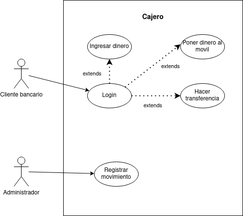

# Diagrama de casos de uso - Cajero ATM

## Índice
- [Especificación de actores](#especificación-de-actores)
    - [Cliente bancario](#actor-cliente-bancario)
    - [Administrador](#actor-administrador)
- [Especificación de casos de uso](#especificación-de-actores)
    - [Ingresar dinero](#ingresar-dinero)
    - [Hacer transferencia](#hacer-transferencia)
    - [Poner dinero al movil](#poner-dinero-al-movil)
    - [Login](#login)
    - [Registrar movimiento](#registrar-movimiento)

## Especificación de actores

### Actor 'Cliente bancario'

|  Actor cuqui | Cliente bancario |
|---|---|
| Descripción  | Aquella persona que contrata un producto o servicio con una entidad financiera.  |
| Relaciones | En el diagrama de casos de uso actual no se encuentra ninguna relación directa con otro actor. |
| Referencias | CU-01, CU-02, CU-03, CU-04 |   
| Autor  | Jesús Daniel Lugo López |
|Fecha | 25 de Enero, 2024 |

### Actor 'Administrador'

|  Actor cuqui| Administrador |
|---|---|
| Descripción  | Persona que gestiona los movimientos de entrada/salida del sistema de cajero. |
| Relaciones | En el diagrama de casos de uso actual no se encuentra ninguna relación directa con otro actor. |
| Referencias | CU-05 |   
| Autor  | Jesús Daniel Lugo López |
|Fecha | 25 de Enero, 2024 | 

## Especificación de casos de uso

### Ingresar dinero

  |  Caso de Uso	CU-01 | Ingresar dinero  |
  |---|---|
  | Actor  |  Cliente bancario |
  | Descripción | El cliente ingresa cierta cantidad de dinero en su cuenta bancaria  |
  | Flujo básico | <table><tr><th>Paso</th><th>Acción</th></tr><tr><td>1</td><td>El cliente ingresa en el sistema la cantidad de dinero a depositar.</td></tr><tr><td>2</td><td>El cliente ingresa el dinero en efectivo.</td></tr><tr><td>3</td><td>El sistema devuelve dinero si hace falta.</td></tr><tr><td>4</td><td>Se cierra el depósito en el sistema.</td></tr></table> |
  | Flujo alternativo | <table><tr><th>Paso</th><th>Acción</th></tr><tr><td>2</td><td>Si el dinero que el cliente ingresa es insuficiente...</td></tr><tr><td></td><td>A.1. El sistema devuelve todo el dinero y se cierra el caso de uso.</td></tr></table> |
  | Pre-condiciones | El cliente debe haberse autenticado en el sistema. |  
  | Post-condiciones  | El dinero es depositado en la cuenta bancaria.  |  
  |  Requerimientos | Dinero en efectivo |
  | Autor  | Jesús Daniel Lugo López |
  |Fecha | 25 de Enero, 2024 |

### Hacer transferencia

  |  Caso de Uso	CU-02 | Hacer transferencia  |
  |---|---|
  | Actor  |  Cliente bancario |
  | Descripción | El cliente realiza una transferencia a otra cuenta bancaria. |
  | Flujo básico | <table><tr><th>Paso</th><th>Acción</th></tr><tr><td>1</td><td>El cliente ingresa el identificador de la otra cuenta bancaria.</td></tr><tr><td>2</td><td>El cliente ingresa la cantidad de dinero a transferir.</td></tr></table> |
  | Flujo alternativo | <table><tr><th>Paso</th><th>Acción</th></tr><tr><td>1</td><td>Si el identificador no existe/está mal escrito...</td></tr><tr><td></td><td>A.1. Se cierra el caso de uso.</td></tr></table> |  
  |Pre-condiciones | El cliente debe haberse autenticado previamente. |
  | Post-condiciones  | El dinero se es transferido a la otra cuenta bancaria. |  
  |  Requerimientos | Dinero suficiente a la cantidad correspondida. |
  | Autor  | Jesús Daniel Lugo López |
  |Fecha | 25 de Enero, 2024 |

### Poner dinero al movil

  |  Caso de Uso	CU-03 | Poner dinero al movil  |
  |---|---|
  | Actor  |  Cliente bancario |
  | Descripción | El cliente puede transferir directamente al servicio de telefonía para recargar datos en su movil. |
  | Flujo básico | <table><tr><th>Paso</th><th>Acción</th></tr><tr><td>1</td><td>El cliente elige la empresa de telefonía.</td></tr><tr><td>2</td><td>Ingresa el número teléfonico</td></tr><tr><td>3</td><td>Elige entre los planes de datos disponibles</td></tr><tr><td>4</td><td>Confirma la elección y efectua la transferencia.</td></tr></table> |
  |Flujo alternativo|N/A|
  | Pre-condiciones | El cliente debe haberse autenticado y configurado el número teléfonico y/o empresa de telefonía en su cuenta bancaria.  |  
  | Post-condiciones  | Se recarga según un plan de datos/saldo el télefono movil.  |  
  |  Requerimientos | Dinero necesario y empresa de telefonía configurada.  |
  | Autor  | Jesús Daniel Lugo López |
  |Fecha | 25 de Enero, 2024 |

### Login

  |  Caso de Uso	CU-04 | Login  |
  |---|---|
  | Actor  |  Cliente bancario |
  | Descripción | El cliente debe ser autenticado en la cuenta bancaria con su contraseña e identificación  |
  | Flujo básico | <table><tr><th>Paso</th><th>Acción</th></tr><tr><td>1</td><td>El cliente ingresa la opción de identificación (Número telefónico, DNI/NIE/NIF...)</td></tr><tr><td>2</td><td>Ingresa la contraseña</td></tr></table> |
  | Flujo alternativo | <table><tr><th>Paso</th><th>Acción</th></tr><tr><td>1</td><td>En caso de que la identificación no esté registrada...</td></tr><tr><td></td><td>A.1 Se cierra el caso de uso.</td></tr><tr><td>2</td><td>En caso de que la contraseña ingresada sea incorrecta...</td></tr><tr><td></td><td>A.1 Se cierra el caso de uso.</td></tr></table>|
  | Pre-condiciones | El cliente debe estar registrado con una cuenta bancaria. |  
  | Post-condiciones  | El cliente ingresa al menú de opciones disponibles para realizar en el cajero. |  
  |  Requerimientos | N/A |
  | Autor  | Jesús Daniel Lugo López |
  |Fecha | 25 de Enero, 2024 |

### Registrar movimiento

  |  Caso de Uso	CU-05 | Registrar movimiento  |
  |---|---|
  | Actor  |  Administrador |
  | Descripción | El administrador genera un registro de entradas y salidas de dinero del cajero automático. |
  | Flujo básico | <table><tr><th>Paso</th><th>Acción</th></tr><tr><td>1</td><td>El administrador realiza la autentificación en el sistema.</td></tr><tr><td>2</td><td>Elige la opción de registrar movimiento.</td></tr><tr><td>3</td><td>Genera un fichero donde se hayan los movimientos del cajero automático.</td></tr></table> |
  |Flujo alternativo|<table><tr><th>Paso</th><th>Acción</th></tr><tr><td>1</td><td>Si no es autentificado...</td></tr><tr><td></td><td>A.1 Se cierra el caso de uso.</td></tr></table>|
  | Pre-condiciones | El administrador debe tener el acceso necesario para realizar los registros.  |  
  | Post-condiciones  | Se genera un archivo con las entradas/salidas del cajero automático.  |  
  |  Requerimientos | N/A  |
  | Autor  | Jesús Daniel Lugo López |
  |Fecha | 25 de Enero, 2024 |

