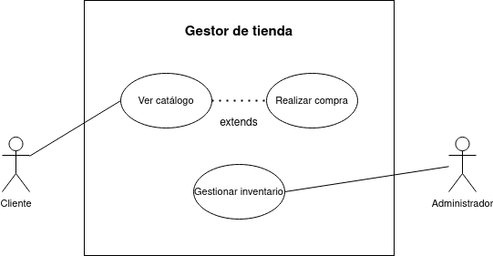

# Diagrama de casos de uso - Gestión de tienda

## Especificación de los actores

|  Actor | Cliente |
|---|---|
| Descripción  | Persona quien verá el catálogo de productos y realizará compras. |
| Relaciones | No hay relación directa con el administrador. |
| Referencias | **Ver catálogo** y **Realizar compra** |   
| Autor  | Jesús Daniel Lugo López |
|Fecha | 16 de Enero, 2024 |

|  Actor | Administrador |
|---|---|
| Descripción  | Quien gestiona el inventario de la tienda. |
| Relaciones | No hay relación directa con el cliente.  |
| Referencias | **Gestionar inventario** |   
| Autor  | Jesús Daniel Lugo López |
|Fecha | 16 de Enero, 2024 |

## Especificación de los casos de uso

  |  Caso de Uso	CU | Ver catálogo  |
  |---|---|
  | Actor  |  Cliente |
  | Descripción | El cliente podrá ver el catálogo de productos disponibles en la tienda. |
  | Flujo básico | <table><tr><th>Paso</th><th>Acción</th></tr><tr><td>1</td><td>Cliente introduce el nombre del producto para comprobar su disponibilidad.</td></tr><tr><td>2</td><td>Se le presentará al cliente la opción de solicitarlo.</td></tr><tr><td>3</td><td>Se envía la solicitud al caso de uso de compra.</td></tr></table> |
  | Flujo alternativo | <table><tr><th>Paso</th><th>Acción</th></tr><tr><td>1</td><td>Si no está disponible...</td></tr><tr><td></td><td>A.1. Se cierra el caso de uso.</td></tr><tr><td>2</td><td>Si no se solicita...</td></tr><tr><td></td><td>A.1. Se cierra el caso de uso.</td></tr></table>|
  | Pre-condiciones | Nombre del producto  |  
  | Post-condiciones  | Devolver un mensaje que indique la disponibilidad del producto y la opción de compra  |  
  |  Requerimientos | N/A |
  | Autor  | Jesús Daniel Lugo López |
  |Fecha | 16 de Enero, 2024 |

  |  Caso de Uso	CU | Realizar compra  |
  |---|---|
  | Actor  |  Cliente |
  | Descripción | Comprar el producto buscado en el catálogo.  |
  | Flujo básico | <table><tr><th>Paso</th><th>Acción</th></tr><tr><td>1</td><td>Cliente solicita el producto.</td></tr><tr><td>2</td><td>Lo paga con el método configurado.</td></tr><tr><td>3</td><td>Recibe el producto via correo o es llamado a buscarlo presencialmente.</td></tr></table> |
  | Flujo alternativo | <table><tr><th>Paso</th><th>Acción</th></tr><tr><td>2</td><td>Si no tiene el dinero suficiente...</td></tr><tr><td></td><td>Se muestra un mensaje de 'Dinero insuficiente' y se cierra el caso de uso.</td></tr></table>
  | Pre-condiciones | Que el producto esté disponible, que haya dinero suficiente,  |  
  | Post-condiciones  | El cliente tendrá su producto. |  
  |  Requerimientos | Dinero necesario  |
  | Autor  | Jesús Daniel Lugo López |
  |Fecha | 16 de Enero, 2024 |

  |  Caso de Uso	CU | Gestionar inventario  |
  |---|---|
  | Actor  |  Administrador |
  | Descripción | Añadir, contabilizar y registrar productos en el inventario de la tienda  |
  | Flujo básico | <table><tr><th>Paso</th><th>Acción</th></tr><tr><td>1</td><td>El administrador lleva un registro de la entrada/salida de un producto.</td></tr><tr><td>2</td><td>Guarda el registro en el sistema de gestión.</td></tr></table> |
  | Flujo alternativo | N/A |
  | Pre-condiciones | No hay información  |  
  | Post-condiciones  | No hay información |  
  |  Requerimientos | No hay información  |
  | Autor  | Jesús Daniel Lugo López |
  |Fecha | 16 de Enero, 2024 |