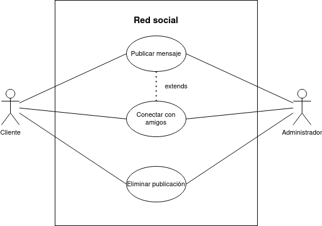

# Diagrama de casos de uso - Red social

## Especificación de actores

|  Actor | Cliente |
|---|---|
| Descripción  | Quien utiliza las funciones de la red social desde una perspectiva de usuario sin interferir con los puntos técnicos que este presente en su funcionamiento.  |
| Relaciones | Ambos pueden verse relacionados en cualquiera de las interacciones mostradas en el diagrama gráfico.  |
| Referencias | CU-01, CU-02 y CU-03 |  
| Autor  | Jesús Daniel Lugo López |
|Fecha | 18 de Enero, 2024 |

|  Actor | Administrador |
|---|---|
| Descripción  | Quien, además de poder utilizar las funciones básicas de las redes sociales como un usuario normal, puede modificar y observar los aspectos técnicos del sistema. |
| Relaciones | Ambos pueden verse relacionados en cualquiera de las interacciones mostradas en el diagrama gráfico.  |
| Referencias | CU-01, CU-02 y CU-03 |  
| Autor  | Jesús Daniel Lugo López |
|Fecha | 18 de Enero, 2024 |

## Especificación de casos de uso

 |  Caso de Uso	CU-01 | Publicar mensaje  |
  |---|---|
  | Actor  |  Cliente y Administrador |
  | Descripción | Publicar un mensaje en la red social para que sea vista por otros usuarios/administradores. |
  | Flujo básico | Se escribe el mensaje a publica -> se adjunta algún fichero/imagen si este se quiere hacer y si se presenta la opción -> se configura la privacidad de la publicación -> se publica en la red social. |
  | Pre-condiciones | Si el mensaje será publicado en perfil de un amigo, se debe antes conectar con el mismo. |  
  | Post-condiciones  | El mensaje se habrá publicado.  |  
  |  Requerimientos | N/A |
  | Autor  | Jesús Daniel Lugo López |
  |Fecha | 18 de Enero, 2024 |

   |  Caso de Uso	CU-02 | Conectar con amigos  |
  |---|---|
  | Actor  |  Cliente y Administrador |
  | Descripción | La opción permite conectar con los amigos y añadirlos a una 'lista de amigos' que facilite la conexión y comunicación con los mismos.  |
  | Flujo básico | Se introduce en el buscador el nombre de usuario de la persona que desea buscar -> tras mostrar su perfil se decide la opción a efectuar, como enviar solicitud de amistad, enviar mensaje o bloquear. |
  | Pre-condiciones | N/A  |  
  | Post-condiciones  | Depende de las opciones mostradas. |  
  |  Requerimientos | Nombre de usuario  |
  | Autor  | Jesús Daniel Lugo López |
  |Fecha | 18 de Enero, 2024 |

   |  Caso de Uso	CU-03 | Eliminar publicación  |
  |---|---|
  | Actor  |  Cliente y Administrador |
  | Descripción | La opción permite al usuario/administrador eliminar publicaciones propias de su perfil o de perfiles ajenos siempre cuando su autoría sea de sí mismos.  |
  | Flujo básico | Selecciona la opción en la publicación a borrar. |
  | Pre-condiciones | Que se haya publicado el mensaje previamente y este sea de su autoría.  |  
  | Post-condiciones  | La publicación será eliminada.  |  
  |  Requerimientos |La autoría de la publicación. |
  | Autor  | Jesús Daniel Lugo López |
  |Fecha | 18 de Enero, 2024 |
