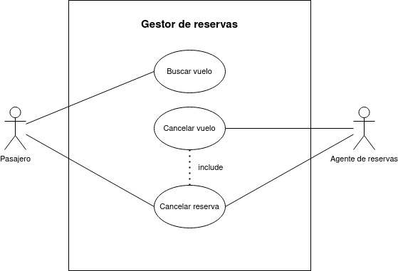

# Diagrama de casos de usos - Reserva de vuelos

## Especificación de actores

|  Actor | Pasajero |
|---|---|
| Descripción  | Persona que puede buscar vuelos para reservar. |
| Características  | No hay información |
| Relaciones | Al cancelar reserva, esta es procesado por el agente.  |
| Referencias | CU-01, CU-03 |   
| Autor  | Jesús Daniel Lugo López |
|Fecha | 18 de Enero, 2024 |

|  Actor | Agente de reservas |
|---|---|
| Descripción  | Quien tiene capacidad para cancelar vuelos y reservar en el sistema.  |
| Características  | No hay información |
| Relaciones | Procesa las cancelaciones de reserva por parte de los pasajeros. |
| Referencias | CU-02, CU-03 |   
| Autor  | Jesús Daniel Lugo López |
|Fecha | 18 de Enero, 2024 |

## Especificación de casos de uso

|  Caso de Uso CU-01 | Buscar vuelo  |
  |---|---|
  | Actor  | Pasajero |
  | Descripción | El cliente podrá buscar en el sistema de gestión los vuelos junto a sus destinos y precios.  |
  | Flujo básico | <table><tr><th>Paso</th><th>Acción</th></tr><tr><td>1</td><td>El usuario entra en el sistema y realiza la búsqueda.</td></tr><tr><td>2</td><td>Se muestra los vuelos disponibles.</td></tr><tr><td>3</td><td>Presenta la opción de reservar vuelo.</td></tr></table>|
  | Flujo alternativo | <table><tr><th>Paso</th><th>Acción</th></tr><tr><td>2</td><td>Si no hay vuelos disponibles para el destino elegido.</td></tr><tr><td></td><td>A.1. Se cierra el caso de uso.</td></tr></table> |
  | Pre-condiciones | No hay información |  
  | Post-condiciones  | Genera la reserva del vuelo asignado al pasajero |  
  |  Requerimientos | N/A |
  | Autor  | Jesús Daniel Lugo López |
  |Fecha | 18 de Enero, 2024 |

  
  |  Caso de Uso CU-02 | Cancelar vuelo  |
  |---|---|
  | Actor  |  Agente de reservas |
  | Descripción | El administrador del sistema podrá, tras cancelar la reserva, cancelar el vuelo de un pasajero  |
  | Flujo básico | <table><tr><th>Paso</th><th>Acción</th></tr><tr><td>1</td><td>El agente entra en el sistema y realiza la búsqueda de los vuelos y reservas.</td></tr><tr><td>2</td><td>Se muestra los vuelos disponibles.</td></tr><tr><td>3</td><td>Presenta la opción de cancelar vuelos/reservas.</td></tr></table> |
  | Flujo alternativo | N/A
  | Pre-condiciones | Que exista una reserva  |  
  | Post-condiciones  | El vuelo es cancelado  |  
  |  Requerimientos | No hay información  |
  | Autor  | Jesús Daniel Lugo López |
  |Fecha | 18 de Enero, 2024 |

  |  Caso de Uso CU-03 | Cancelar reserva  |
  |---|---|
  | Actor  |  Pasajero y agente de reserva|
  | Descripción | Tanto el pasajero como el agente de reserva puede cancelar reservas del sistema.  |
  | Flujo básico | <table><tr><th>Paso</th><th>Acción</th></tr><tr><td>1</td><td>El agente o el usuario realiza la búsqueda de la reserva a cancelar.</td></tr><tr><td>2</td><td>Se cancela la reserva elegida.</td></tr></table>  |
  | Flujo alternativo | N/A |
  | Pre-condiciones | Debe existir una reserva |  
  | Post-condiciones  | Reserva cancelada |  
  |  Requerimientos | No hay información |
  | Autor  | Jesús Daniel Lugo López |
  |Fecha | 18 de Enero, 2024 |