# Tarea asociada al uso de Flex

## Contenidos 

1. [Ejercicio 1](#ejercicio-1)
2. [Ejercicio 2](#ejercicio-2)
3. [Ejercicio 3](#ejercicio-3)
4. [Ejercicio 4](#ejercicio-4)
5. [Ejercicio 5](#ejercicio-5)
6. [Ejercicio 6](#ejercicio-6)
7. [Ejercicio 7](#ejercicio-7)
8. [Ejercicio 8](#ejercicio-8)
9. [Ejercicio 9](#ejercicio-9)
10. [Ejercicio 10](#ejercicio-10)
11. [Ejercicio 11](#ejercicio-11)
12. [Ejercicio 12](#ejercicio-12)

## Ejercicio 1

```html
<!DOCTYPE html>
<html>
<head>
    <meta charset="UTF-8" />
    <meta name="author" content="juan carlos p.r."/>
    <meta name="viewport" content="width=device-width, initial-scale=1.0"/>
    <title>inicios con flex</title>

    <style type="text/css" >
        header, section, footer, aside, nav, main, article, figure {
        display: block;
        }
        .contenedorFlex {
        display: flex;
        background: #F6EBC6;
        }
    </style>
</head>

<body>
    <main class="contenedorFlex">
        <p>1 Lorem ipsum dolor sit amet, consectetur adipisicing elit. Eum incidunt, nostrum! lorem</p>
        <p>2 Lorem ipsum dolor sit amet, consectetur adipisicing elit. Inventore ipsa laudantium ea.</p>
        <p>3 Lorem ipsum dolor sit amet, consectetur adipisicing elit. Totam laborum provident pariatur aspernatur? Lorem ipsum dolor sit amet, consectetur adipisicing elit. Id maiores reiciendis quod sit cupiditate debitis amet mollitia, recusandae consequatur alias!</p>
        <p>4 Lorem ipsum dolor sit amet, consectetur adipisicing elit. Totam voluptatem tempore blanditiis facere natus.</p>
        <p>5 Lorem ipsum dolor sit amet, consectetur adipisicing elit. Voluptates, animi! Reiciendis, sequi, quasi. Totam, minus. Lorem ipsum dolor sit amet, consectetur adipisicing elit. Voluptatum, eius, velit reiciendis molestiae vitae ipsam.</p>
    </main>
</body>
</html>
```
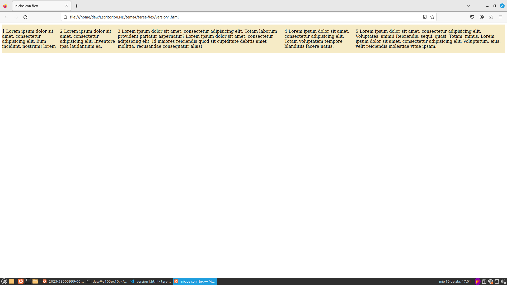

## Ejercicio 2

```html
<!DOCTYPE html>
<html>
<head>
    <meta charset="UTF-8" />
    <meta name="author" content="juan carlos p.r."/>
    <meta name="viewport" content="width=device-width, initial-scale=1.0"/>
    <title>inicios con flex</title>

    <style type="text/css" >
        header, section, footer, aside, nav, main, article, figure {
        display: block;
        }
        .contenedorFlex {
        display: flex;
        background: #F6EBC6;
        }
        p {
        max-width: 20%;
        border: 1px solid gray;
        }
    </style>
</head>

<body>
    <main class="contenedorFlex">
        <p>1 Lorem ipsum dolor sit amet, consectetur adipisicing elit. Eum incidunt, nostrum! lorem</p>
        <p>2 Lorem ipsum dolor sit amet, consectetur adipisicing elit. Inventore ipsa laudantium ea.</p>
        <p>3 Lorem ipsum dolor sit amet, consectetur adipisicing elit. Totam laborum provident pariatur aspernatur? Lorem ipsum dolor sit amet, consectetur adipisicing elit. Id maiores reiciendis quod sit cupiditate debitis amet mollitia, recusandae consequatur alias!</p>
        <p>4 Lorem ipsum dolor sit amet, consectetur adipisicing elit. Totam voluptatem tempore blanditiis facere natus.</p>
        <p>5 Lorem ipsum dolor sit amet, consectetur adipisicing elit. Voluptates, animi! Reiciendis, sequi, quasi. Totam, minus. Lorem ipsum dolor sit amet, consectetur adipisicing elit. Voluptatum, eius, velit reiciendis molestiae vitae ipsam.</p>
    </main>
</body>
</html>
```
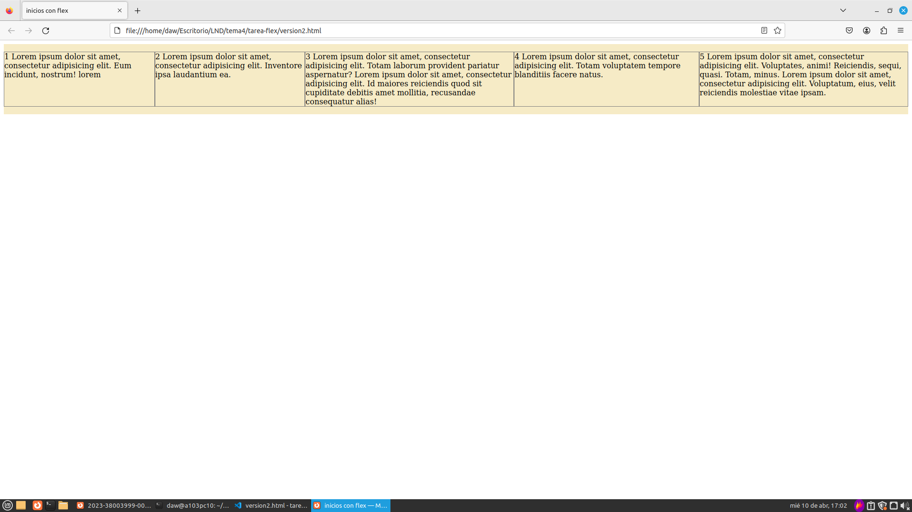

## Ejercicio 3

```html
<!DOCTYPE html>
<html>
<head>
    <meta charset="UTF-8" />
    <meta name="author" content="juan carlos p.r."/>
    <meta name="viewport" content="width=device-width, initial-scale=1.0"/>
    <title>inicios con flex</title>

    <style type="text/css" >
        header, section, footer, aside, nav, main, article, figure{
        display: block;
        }
        .contenedorFlex{
        display: flex;
        flex-flow: row wrap;
        background: #F6EBC6;
        }
        p{
        max-width: 23%;
        border: 1px solid gray;
        }
    </style>
</head>

<body>
    <main class="contenedorFlex">
        <p>1 Lorem ipsum dolor sit amet, consectetur adipisicing elit. Eum incidunt, nostrum! lorem</p>
        <p>2 Lorem ipsum dolor sit amet, consectetur adipisicing elit. Inventore ipsa laudantium ea.</p>
        <p>3 Lorem ipsum dolor sit amet, consectetur adipisicing elit. Totam laborum provident pariatur aspernatur? Lorem ipsum dolor sit amet, consectetur adipisicing elit. Id maiores reiciendis quod sit cupiditate debitis amet mollitia, recusandae consequatur alias!</p>
        <p>4 Lorem ipsum dolor sit amet, consectetur adipisicing elit. Totam voluptatem tempore blanditiis facere natus.</p>
        <p>5 Lorem ipsum dolor sit amet, consectetur adipisicing elit. Voluptates, animi! Reiciendis, sequi, quasi. Totam, minus. Lorem ipsum dolor sit amet, consectetur adipisicing elit. Voluptatum, eius, velit reiciendis molestiae vitae ipsam.</p>
    </main>
</body>
</html>
```
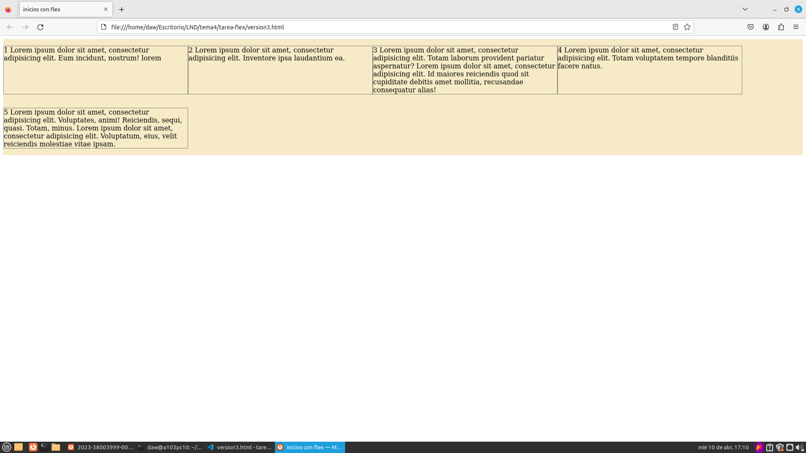

## Ejercicio 4

```html
<!DOCTYPE html>
<html>
<head>
    <meta charset="UTF-8" />
    <meta name="author" content="juan carlos p.r."/>
    <meta name="viewport" content="width=device-width, initial-scale=1.0"/>
    <title>inicios con flex</title>

    <style type="text/css" >
        header, section, footer, aside, nav, main, article, figure{
        display: block;
        }
        .contenedorFlex{
        display: flex;
        flex-flow: column wrap;
        background: #F6EBC6;
        height: 400px;
        }
        p{
        max-width: 23%;
        border: 1px solid gray;
        }
    </style>
</head>

<body>
    <main class="contenedorFlex">
        <p>1 Lorem ipsum dolor sit amet, consectetur adipisicing elit. Eum incidunt, nostrum! lorem</p>
        <p>2 Lorem ipsum dolor sit amet, consectetur adipisicing elit. Inventore ipsa laudantium ea.</p>
        <p>3 Lorem ipsum dolor sit amet, consectetur adipisicing elit. Totam laborum provident pariatur aspernatur? Lorem ipsum dolor sit amet, consectetur adipisicing elit. Id maiores reiciendis quod sit cupiditate debitis amet mollitia, recusandae consequatur alias!</p>
        <p>4 Lorem ipsum dolor sit amet, consectetur adipisicing elit. Totam voluptatem tempore blanditiis facere natus.</p>
        <p>5 Lorem ipsum dolor sit amet, consectetur adipisicing elit. Voluptates, animi! Reiciendis, sequi, quasi. Totam, minus. Lorem ipsum dolor sit amet, consectetur adipisicing elit. Voluptatum, eius, velit reiciendis molestiae vitae ipsam.</p>
    </main>
</body>
</html>
```


## Ejercicio 5

```html
<!DOCTYPE html>
<html>
<head>
    <meta charset="UTF-8" />
    <meta name="author" content="juan carlos p.r."/>
    <meta name="viewport" content="width=device-width, initial-scale=1.0"/>
    <title>inicios con flex</title>

    <style type="text/css" >
        header, section, footer, aside, nav, main, article, figure{
        display: block;
        }
        .contenedorFlex{
        display: flex;
        flex-flow: row nowrap;
        justify-content: flex-start;
        background: #F6EBC6;
        }
        p{
        max-width: 15%;
        border: 1px solid gray;
        }
    </style>
</head>

<body>
    <main class="contenedorFlex">
        <p>1 Lorem ipsum dolor sit amet, consectetur adipisicing elit. Eum incidunt, nostrum! lorem</p>
        <p>2 Lorem ipsum dolor sit amet, consectetur adipisicing elit. Inventore ipsa laudantium ea.</p>
        <p>3 Lorem ipsum dolor sit amet, consectetur adipisicing elit. Totam laborum provident pariatur aspernatur? Lorem ipsum dolor sit amet, consectetur adipisicing elit. Id maiores reiciendis quod sit cupiditate debitis amet mollitia, recusandae consequatur alias!</p>
        <p>4 Lorem ipsum dolor sit amet, consectetur adipisicing elit. Totam voluptatem tempore blanditiis facere natus.</p>
        <p>5 Lorem ipsum dolor sit amet, consectetur adipisicing elit. Voluptates, animi! Reiciendis, sequi, quasi. Totam, minus. Lorem ipsum dolor sit amet, consectetur adipisicing elit. Voluptatum, eius, velit reiciendis molestiae vitae ipsam.</p>
    </main>
</body>
</html>
```
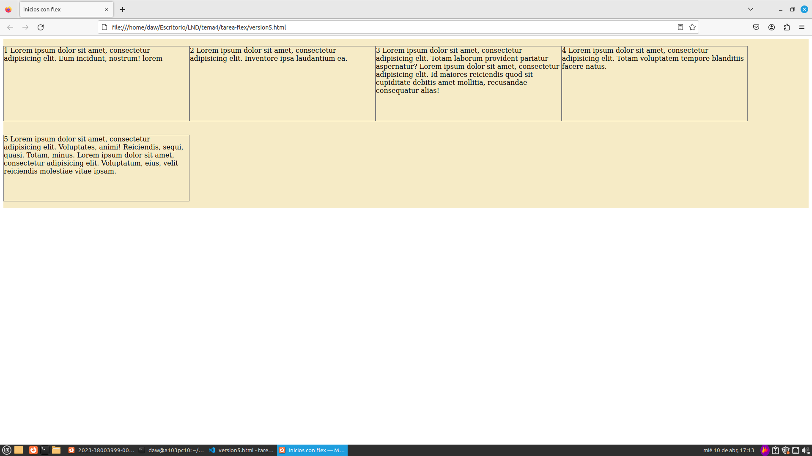

## Ejercicio 6

```html
<!DOCTYPE html>
<html>
<head>
    <meta charset="UTF-8" />
    <meta name="author" content="juan carlos p.r."/>
    <meta name="viewport" content="width=device-width, initial-scale=1.0"/>
    <title>inicios con flex</title>

    <style type="text/css" >
        header, section, footer, aside, nav, main, article, figure{
        display: block;
        }
        .contenedorFlex{
        display: flex;
        flex-flow: row wrap;
        justify-content: flex-start;
        align-items: flex-start;
        background: #F6EBC6;
        }
        p{
        max-width: 31%;
        border: 1px solid gray;
        }
    </style>
</head>

<body>
    <main class="contenedorFlex">
        <p>1 Lorem ipsum dolor sit amet, consectetur adipisicing elit. Eum incidunt, nostrum! lorem</p>
        <p>2 Lorem ipsum dolor sit amet, consectetur adipisicing elit. Inventore ipsa laudantium ea.</p>
        <p>3 Lorem ipsum dolor sit amet, consectetur adipisicing elit. Totam laborum provident pariatur aspernatur? Lorem ipsum dolor sit amet, consectetur adipisicing elit. Id maiores reiciendis quod sit cupiditate debitis amet mollitia, recusandae consequatur alias!</p>
        <p>4 Lorem ipsum dolor sit amet, consectetur adipisicing elit. Totam voluptatem tempore blanditiis facere natus.</p>
        <p>5 Lorem ipsum dolor sit amet, consectetur adipisicing elit. Voluptates, animi! Reiciendis, sequi, quasi. Totam, minus. Lorem ipsum dolor sit amet, consectetur adipisicing elit. Voluptatum, eius, velit reiciendis molestiae vitae ipsam.</p>
    </main>
</body>
</html>
```
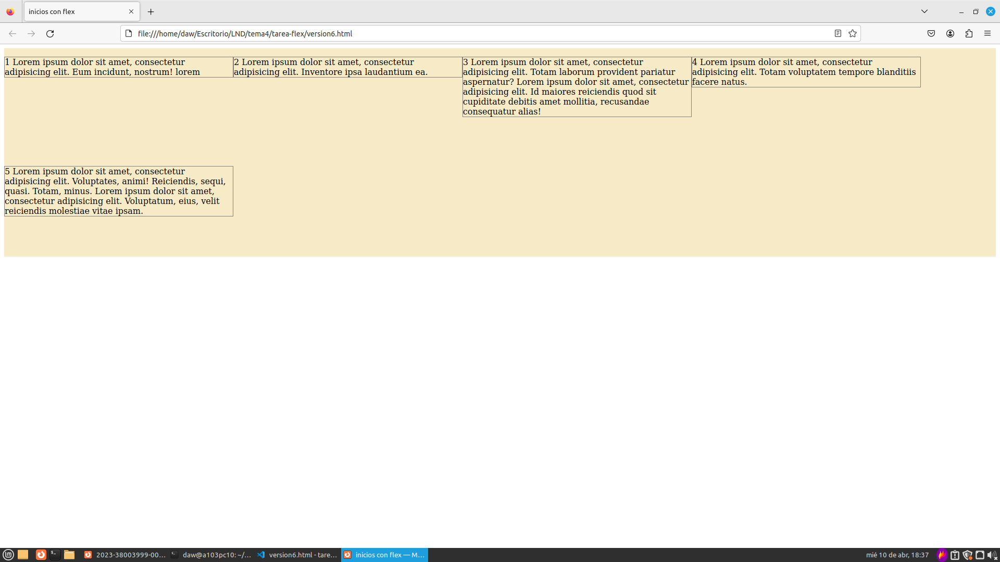

## Ejercicio 7

```html
<!DOCTYPE html>
<html>
<head>
    <meta charset="UTF-8" />
    <meta name="author" content="juan carlos p.r."/>
    <meta name="viewport" content="width=device-width, initial-scale=1.0"/>
    <title>inicios con flex</title>

    <style type="text/css" >
        header, section, footer, aside, nav, main, article, figure{
        display: block;
        }
        .contenedorFlex{
        display: flex;
        flex-flow: row wrap;
        justify-content: flex-start;
        align-items: flex-start;
        background: #F6EBC6;
        }
        p{
        flex: 0 0 20%;
        border: 1px solid gray;
        }
    </style>
</head>

<body>
    <main class="contenedorFlex">
        <p>1 Lorem ipsum dolor sit amet, consectetur adipisicing elit. Eum incidunt, nostrum! lorem</p>
        <p>2 Lorem ipsum dolor sit amet, consectetur adipisicing elit. Inventore ipsa laudantium ea.</p>
        <p>3 Lorem ipsum dolor sit amet, consectetur adipisicing elit. Totam laborum provident pariatur aspernatur? Lorem ipsum dolor sit amet, consectetur adipisicing elit. Id maiores reiciendis quod sit cupiditate debitis amet mollitia, recusandae consequatur alias!</p>
        <p>4 Lorem ipsum dolor sit amet, consectetur adipisicing elit. Totam voluptatem tempore blanditiis facere natus.</p>
        <p>5 Lorem ipsum dolor sit amet, consectetur adipisicing elit. Voluptates, animi! Reiciendis, sequi, quasi. Totam, minus. Lorem ipsum dolor sit amet, consectetur adipisicing elit. Voluptatum, eius, velit reiciendis molestiae vitae ipsam.</p>
    </main>
</body>
</html>
```
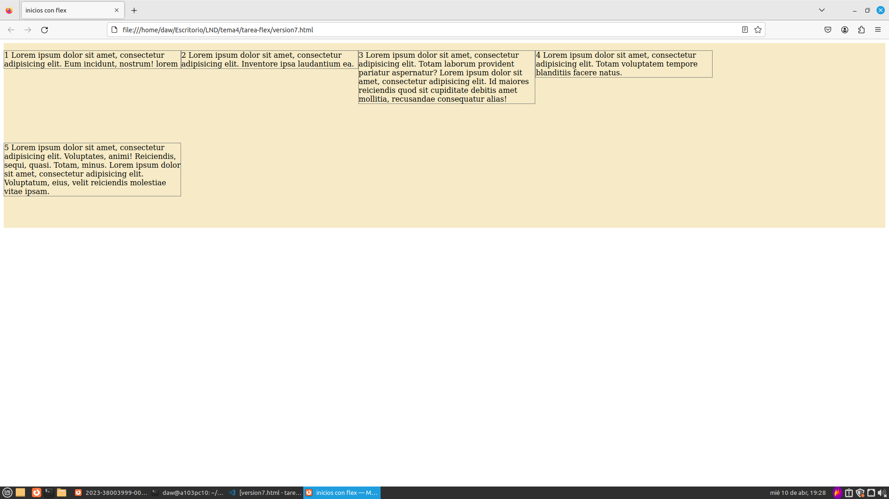

## Ejercicio 8

```html
<!DOCTYPE html>
<html>
<head>
    <meta charset="UTF-8" />
    <meta name="author" content="juan carlos p.r."/>
    <meta name="viewport" content="width=device-width, initial-scale=1.0"/>
    <title>inicios con flex</title>

    <style type="text/css" >
        header, section, footer, aside, nav, main, article, figure{
        display: block;
        }
        .contenedorFlex{
        display: flex;
        flex-flow: row wrap;
        justify-content: flex-start;
        align-items: stretch;
        background: #F6EBC6;
        }
        p:not(:nth-of-type(1)){
        border: 1px solid gray;
        flex: 1 0 20%;
        }
        p:nth-of-type(1){
        border: 1px solid gray;
        flex: 7 0 20%;
        }
    </style>
</head>

<body>
    <main class="contenedorFlex">
        <p>1 Lorem ipsum dolor sit amet, consectetur adipisicing elit. Eum incidunt, nostrum! lorem</p>
        <p>2 Lorem ipsum dolor sit amet, consectetur adipisicing elit. Inventore ipsa laudantium ea.</p>
        <p>3 Lorem ipsum dolor sit amet, consectetur adipisicing elit. Totam laborum provident pariatur aspernatur? Lorem ipsum dolor sit amet, consectetur adipisicing elit. Id maiores reiciendis quod sit cupiditate debitis amet mollitia, recusandae consequatur alias!</p>
        <p>4 Lorem ipsum dolor sit amet, consectetur adipisicing elit. Totam voluptatem tempore blanditiis facere natus.</p>
        <p>5 Lorem ipsum dolor sit amet, consectetur adipisicing elit. Voluptates, animi! Reiciendis, sequi, quasi. Totam, minus. Lorem ipsum dolor sit amet, consectetur adipisicing elit. Voluptatum, eius, velit reiciendis molestiae vitae ipsam.</p>
    </main>
</body>
</html>
```
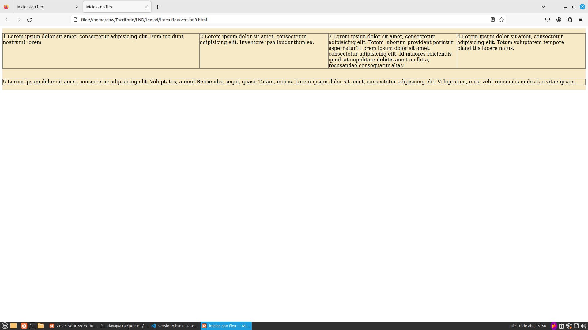

## Ejercicio 9

```html
<!DOCTYPE html>
<html>
<head>
    <meta charset="UTF-8" />
    <meta name="author" content="juan carlos p.r."/>
    <meta name="viewport" content="width=device-width, initial-scale=1.0"/>
    <title>inicios con flex</title>

    <style type="text/css" >
        header, section, footer, aside, nav, main, article, figure{
        display: block;
        }
        .contenedorFlex{
        display: flex;
        flex-flow: row nowrap;
        justify-content: flex-start;
        align-items: stretch;
        background: #F6EBC6;
        }
        p:not(:nth-of-type(2)){
        border: 1px solid gray;
        flex: 0 1 400px;
        }
        p:nth-of-type(2){
        border: 1px solid gray;
        flex: 0 5 400px;
        }
    </style>
</head>

<body>
    <main class="contenedorFlex">
        <p>1 Lorem ipsum dolor sit amet, consectetur adipisicing elit. Eum incidunt, nostrum! lorem</p>
        <p>2 Lorem ipsum dolor sit amet, consectetur adipisicing elit. Inventore ipsa laudantium ea.</p>
        <p>3 Lorem ipsum dolor sit amet, consectetur adipisicing elit. Totam laborum provident pariatur aspernatur? Lorem ipsum dolor sit amet, consectetur adipisicing elit. Id maiores reiciendis quod sit cupiditate debitis amet mollitia, recusandae consequatur alias!</p>
        <p>4 Lorem ipsum dolor sit amet, consectetur adipisicing elit. Totam voluptatem tempore blanditiis facere natus.</p>
        <p>5 Lorem ipsum dolor sit amet, consectetur adipisicing elit. Voluptates, animi! Reiciendis, sequi, quasi. Totam, minus. Lorem ipsum dolor sit amet, consectetur adipisicing elit. Voluptatum, eius, velit reiciendis molestiae vitae ipsam.</p>
    </main>
</body>
</html>
```
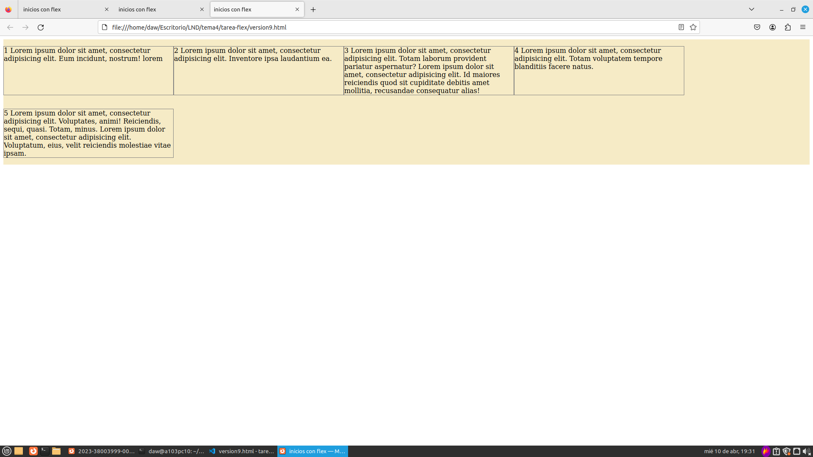

## Ejercicio 10

```html
<!DOCTYPE html>
<html>
<head>
    <meta charset="UTF-8" />
    <meta name="author" content="juan carlos p.r."/>
    <meta name="viewport" content="width=device-width, initial-scale=1.0"/>
    <title>inicios con flex</title>

    <style type="text/css" >
        header, section, footer, aside, nav, main, article, figure{
        display: block;
        }
        .contenedorFlex{
        display: flex;
        flex-flow: row wrap;
        justify-content: flex-start;
        align-items: stretch;
        background: #F6EBC6;
        }
        p{
        border: 5px solid gray;
        margin: 3px;
        flex: 1 0 45%;
        }
    </style>
</head>

<body>
    <main class="contenedorFlex">
        <p>1 Lorem ipsum dolor sit amet, consectetur adipisicing elit. Eum incidunt, nostrum! lorem</p>
        <p>2 Lorem ipsum dolor sit amet, consectetur adipisicing elit. Inventore ipsa laudantium ea.</p>
        <p>3 Lorem ipsum dolor sit amet, consectetur adipisicing elit. Totam laborum provident pariatur aspernatur? Lorem ipsum dolor sit amet, consectetur adipisicing elit. Id maiores reiciendis quod sit cupiditate debitis amet mollitia, recusandae consequatur alias!</p>
        <p>4 Lorem ipsum dolor sit amet, consectetur adipisicing elit. Totam voluptatem tempore blanditiis facere natus.</p>
        <p>5 Lorem ipsum dolor sit amet, consectetur adipisicing elit. Voluptates, animi! Reiciendis, sequi, quasi. Totam, minus. Lorem ipsum dolor sit amet, consectetur adipisicing elit. Voluptatum, eius, velit reiciendis molestiae vitae ipsam.</p>
    </main>
</body>
</html>
```
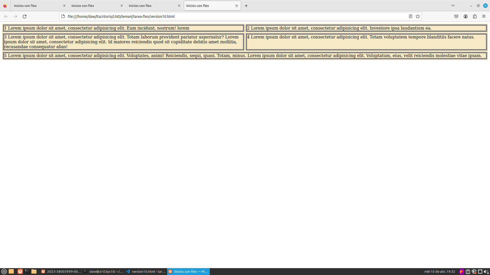

## Ejercicio 11

```html
<!DOCTYPE html>
<html>
<head>
    <meta charset="UTF-8" />
    <meta name="author" content="juan carlos p.r."/>
    <meta name="viewport" content="width=device-width, initial-scale=1.0"/>
    <title>inicios con flex</title>

    <style type="text/css" >
        header, section, footer, aside, nav, main, article, figure{
        display: block;
        }
        .contenedorFlex{
        display: flex;
        flex-flow: row nowrap;
        justify-content: space-between;
        align-items: flex-start;
        background: #F6EBC6;
        }
        p{
        border: 5px solid gray;
        margin: 3px;
        flex: 1 1 15%;
        }
        p:nth-of-type(3){
        align-self: stretch;
        }
        p:nth-of-type(4){
        align-self: center;
        }
    </style>
</head>

<body>
    <main class="contenedorFlex">
        <p>1 Lorem ipsum dolor sit amet, consectetur adipisicing elit. Eum incidunt, nostrum! lorem</p>
        <p>2 Lorem ipsum dolor sit amet, consectetur adipisicing elit. Inventore ipsa laudantium ea.</p>
        <p>3 Lorem ipsum dolor sit amet, consectetur adipisicing elit. Totam laborum provident pariatur aspernatur? Lorem ipsum dolor sit amet, consectetur adipisicing elit. Id maiores reiciendis quod sit cupiditate debitis amet mollitia, recusandae consequatur alias!</p>
        <p>4 Lorem ipsum dolor sit amet, consectetur adipisicing elit. Totam voluptatem tempore blanditiis facere natus.</p>
        <p>5 Lorem ipsum dolor sit amet, consectetur adipisicing elit. Voluptates, animi! Reiciendis, sequi, quasi. Totam, minus. Lorem ipsum dolor sit amet, consectetur adipisicing elit. Voluptatum, eius, velit reiciendis molestiae vitae ipsam.</p>
    </main>
</body>
</html>
```
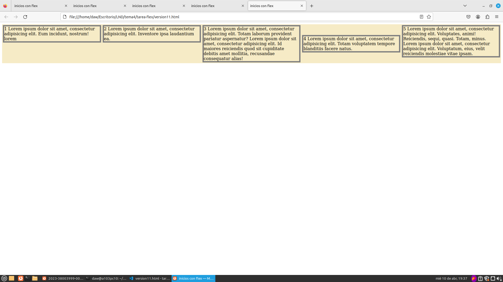

## Ejercicio 12

```html
<!DOCTYPE html>
<html>
<head>
    <meta charset="UTF-8" />
    <meta name="author" content="juan carlos p.r."/>
    <meta name="viewport" content="width=device-width, initial-scale=1.0"/>
    <title>inicios con flex</title>

    <style type="text/css" >
        header, section, footer, aside, nav, main, article, figure{
        display: block;
        }
        .contenedorFlex{
        display: flex;
        flex-flow: row nowrap;
        justify-content: space-between;
        align-items: flex-start;
        background: #F6EBC6;
        }
        p{
        border: 5px solid gray;
        margin: 3px;
        flex: 1 1 15%;
        }
        p:nth-of-type(3){
        align-self: stretch;
        order: -1;
        }
        p:nth-of-type(4){
        align-self: center;
        }
    </style>
</head>

<body>
    <main class="contenedorFlex">
        <p>1 Lorem ipsum dolor sit amet, consectetur adipisicing elit. Eum incidunt, nostrum! lorem</p>
        <p>2 Lorem ipsum dolor sit amet, consectetur adipisicing elit. Inventore ipsa laudantium ea.</p>
        <p>3 Lorem ipsum dolor sit amet, consectetur adipisicing elit. Totam laborum provident pariatur aspernatur? Lorem ipsum dolor sit amet, consectetur adipisicing elit. Id maiores reiciendis quod sit cupiditate debitis amet mollitia, recusandae consequatur alias!</p>
        <p>4 Lorem ipsum dolor sit amet, consectetur adipisicing elit. Totam voluptatem tempore blanditiis facere natus.</p>
        <p>5 Lorem ipsum dolor sit amet, consectetur adipisicing elit. Voluptates, animi! Reiciendis, sequi, quasi. Totam, minus. Lorem ipsum dolor sit amet, consectetur adipisicing elit. Voluptatum, eius, velit reiciendis molestiae vitae ipsam.</p>
    </main>
</body>
</html>
```
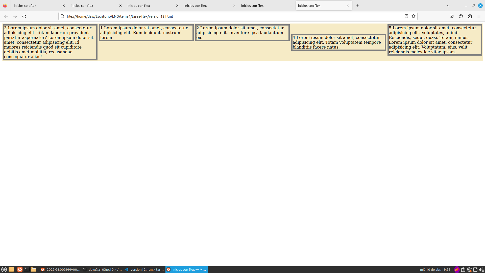
