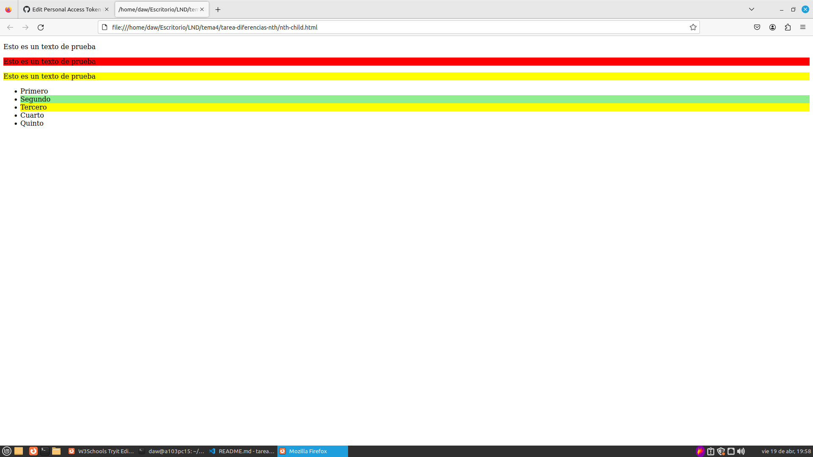

# Diferencias entre nth-child y nth-of-type

_Pez de la buena suerte, pero segundo_

- **nth-child:** Selecciona elementos según su posición general como elemento hijo. En el caso de que hagamos por ejemplo nth-child(1n) pillará los hijos impares (hijo1, hijo3, hijo 5, etc.).
- **nth-of-type:** Selecciona elementos según su posición entre elementos del mismo tipo dentro del padre. En el caso de que hagamos por ejemplo nth-of-type(1n) pillará los elementos del mismo tipo impares (si especificasemos para los párrafos (etiqueta p) sería el párrafo 1, 3, 5, etc.).

## Ejemplos

Viendo primero esta página web en la que usamos `nth-child` ([La página web la puede encontrar aquí](./nth-child.html)):

Podemos observar como la propiedad `nth-child` siempre tomará los hijos indicados, restringiendo su efecto si la etiqueta encontrada no coincide con la colocada en el apartado _style_.

Ahora comparando con la misma página web, en la que reemplazamos `nth-child` con `nth-of-type` ([La página web la puede encontrar aquí](./nth-of-type.html)):

En este caso, podemos observar como `nth-of-type` toma los hijos a partir de los tipos indicados; no a partir del elemento padre.