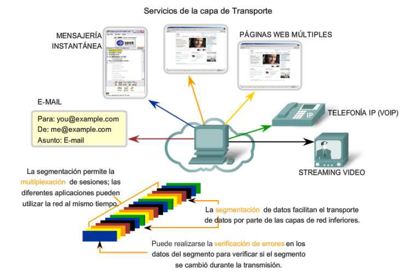

# Unidad 07 - Capas de transporte y aplicación

## Contenido

- [Capa de transporte](#capa-de-transporte)
        - [Responsabilidades](#sus-responsabilidades-principales-son)
                - [Seguimiento de la comunicación individual](#seguimiento-de-la-comunicación-individual)
                - [Segmentación de los datos](#segmentación-de-los-datos)
                - [Reensamble de segmentos](#reensamble-de-segmentos)
                - [Identificación de las aplicaciones](#identificación-de-las-aplicaciones)
                - [Separación de la comunicación multiple](#separación-de-la-comunicación-multiple)
        - [Protocolos: TCP y UDP](#protocolos-tcp-y-udp)
        - [Cacharro: Servidores](#cacharro-de-la-capa-de-transporte-servidores)
- [Capa de aplicación](#capa-de-aplicación)

## Capa de transporte

Prepara los datos de la aplicación para el transporte a través de la red y procesa los datos de la red para su utilización por parte de las aplicaciones.
Esta capa __permite la segmentación de datos y la reensamblación de los mismos__ dentro de los distintos _streams_ de comunicación.

### Sus responsabilidades principales son
- Seguimiento de la comunicación individual entre aplicaciones en los hosts origen y destino.
- Seguimiento de los datos y gestión de cada porción.
- Reensamble de segmentos en flujo de los datos de la aplicación.
- Identificación de las diferentes aplicaciones.

#### Seguimiento de la comunicación individual

Cualquier host puede tener múltiples aplicaciones que se están comunicando a través de la red. Cada una de estas aplicaciones se comunicará con una o más aplicaciones en hosts remotos. Es responsabilidad de la capa de Transporte mantener los diversos streams de comunicación entre estas aplicaciones.

#### Segmentación de los datos

Debido a que cada aplicación genera un stream de datos para enviar a una aplicación remota, estos datos deben prepararse para ser enviados por los medios en partes manejables.

#### Reensamble de segmentos

En el host de recepción, cada sección de datos puede ser direccionada a la aplicación adecuada. Además, estas secciones de datos individuales también deben reconstruirse para generar un stream completo de datos que sea útil para la capa de Aplicación. 

#### Identificación de las aplicaciones

Para poder transferir los streams de datos a las aplicaciones adecuadas, la capa de Transporte debe identificar la aplicación de destino. Para lograr esto, la capa de Transporte asigna un identificador a la aplicación. Los protocolos TCP/IP denominan a este identificador número de puerto.

#### Separación de la comunicación multiple

La segmentación de los datos, que cumple con los protocolos de la capa de Transporte, proporciona los medios para enviar y recibir datos cuando se ejecutan varias aplicaciones de manera concurrente en una computadora. Sin segmentación, sólo una aplicación, la corriente de vídeo por ejemplo, podría recibir datos. No se podrían recibir correos electrónicos, chats ni mensajes instantáneos ni visualizar páginas Web y ver un vídeo al mismo tiempo.

Para identificar todos los segmentos de datos, la capa de Transporte agrega un encabezado a la sección que contiene datos binarios. Este encabezado contiene campos de bits. Son los valores de estos campos los que permiten que los distintos protocolos de la capa de Transporte lleven a cabo las diversas funciones.

    

### Protocolos: TCP y UDP

Los dos protocolos más comunes de la capa de Transporte del conjunto de protocolos TCP/IP son el Protocolo de control de transmisión (TCP) y el Protocolos de datagramas de usuario (UDP). Ambos protocolos gestionan la comunicación de múltiples aplicaciones. Las diferencias entre ellos son las funciones específicas que cada uno implementa.

__TCP__ es un protocolo orientado a la conexión, descrito en la RFC 793. TCP incurre en el uso adicional de recursos para agregar funciones. Las funciones adicionales especificadas por TCP están en el mismo orden de entrega, son de entrega confiable y de control de flujo. 

__UDP__ es un protocolo simple, sin conexión, descrito en la RFC 768. Cuenta con la ventaja de proveer la entrega de datos sin utilizar muchos recursos. Las porciones de comunicación en UDP se llaman datagramas. Este protocolo de la capa de Transporte envía estos datagramas como “mejor intento”.

    

### Cacharro de la capa de transporte: Servidores

## Capa de aplicación
