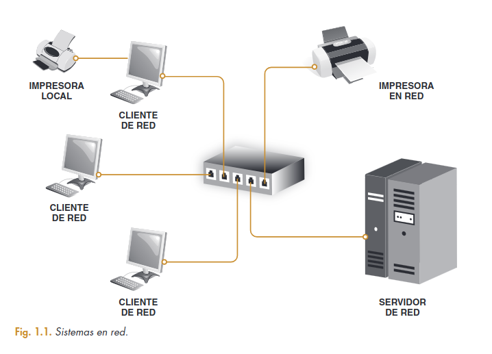

# Unidad 08 - Administración de sistemas operativos en red

Son aquellos sistemas que mantienen a dos o más equipos unidos a través de algún medio de comunicación (físico o no), con el objetivo primordial de poder compartir los diferentes recursos hardware y software.

En un entorno de red podemos diferenciar claramente dos componentes: __Clientes__ y __Servidores__.

    

## Contenidos

- [Selección de un sistema operativo en red](#selección-de-un-sistema-operativo-en-red)

## Selección de un sistema operativo en red

Para decidir qué tipo de infraestructura queremos montar nos basaremos en varios parámetros:

#### Nivel de seguridad de la red

Esta decisión se basa en los tipos de seguridad que se consideran más adecuados. Las redes basadas en servidor permiten incluir más posibilidades relativas a la seguridad que las que nos ofrece un simple grupo de trabajo.

#### Número de usuarios de la red

Cuando el número de usuarios es pequeño, a veces resulta más práctico y fácil de administrar un grupo de trabajo que una red en entorno cliente/servidor ya que el mantenimiento, actualización y gestión de los recursos será pequeño.

#### Número de equipos de la red

Al igual que en el caso anterior y por los mismos motivos, si disponemos de pocos equipos en la red, tal vez será mejor trabajar en un grupo de trabajo que en un entorno de red cliente/servidor.

#### Evaluar la interoperabilidad de la red

Después de identificar las necesidades de seguridad, usuarios y equipos de la red, el siguiente paso es determinar los tipos de interoperabilidad necesaria en la red para que se comporte como una unidad.

> La interoperabilidad es la capacidad de comunicación entre diferentes programas y máquinas de distintos fabricantes. Ejemplo: Android con Windows con Linux con Mac...